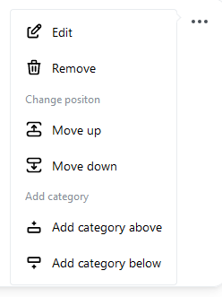
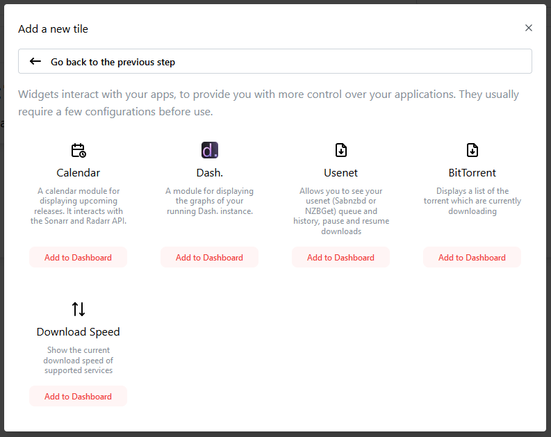
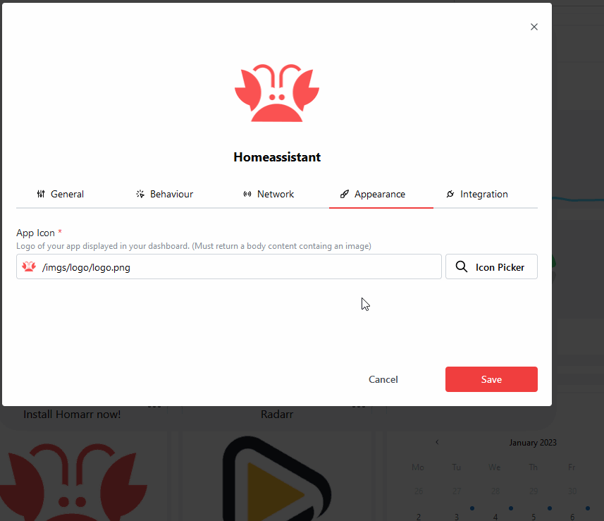

We are *incredibly* proud to serve you Homarr 0.11!
It contains many breaking changes and huge improvements to your favourite dashboard app:

- Integration of Gridstack for much more complex dashboard configuration and drag and drop
- Added icon picker with smart search and automatic icons
- Complete overhaul of the module system
- Added an edit mode for making changes easier
- Form validation for better user experience
- Better security with new built in credentials system
- Huge design and usability improvements to older components to Homarr
- Better handeling of exceptions and unexpected issues

## Complete implementation of highly customizable drag and drop library "Gridstack"

In 0.11, we have replaced our quite limited drag and drop system with Gridstack.
Gridstack enables you to create much more complex and advanced dashboards while keeping everything organized.

<video style={{maxWidth: "min(100%, 600px)", borderRadius: "0.5rem"}} controls preload='auto' autoplay >
  <source src="/img/videos/showcase.mp4" type="video/mp4" />
    

      To view this video please enable JavaScript, and consider upgrading to a
      web browser that
      <a href="https://videojs.com/html5-video-support/" target="_blank">
        supports HTML5 video
      </a>
  

</video>

We've also introduced more advanced categories this time:

We'll continute to improve this system according to your feedback.

## Modules have been overhauled and renamed to widgets

Widgets are now much snappier and have been completly recoded.
This fixes some of the bugs a few users have previously experienced and improves overall customization.

## Fancy icon picker for speeding up your creation process

We've also added a new fancy icon picker, you can use to get access to any icons much faster.
We will add more icon sources in the future, as we made this icon picker very modular, and we plan to make local icons accessible via this picker very soon.

## Design and documentation improvements to homarr.dev

https://homarr.dev has been overhauled with better design, updated documentation, more images and better explanations. We've also added a few community made resources, such as the [icon cache script](/docs/customizations/icon-cache) and [Traefik tutorial](/docs/advanced/proxies-and-certificates#securing-homarr-with-traefik).

## Download Homarr now!

Homarr is completly free, even for commercial usage!

**Download now**:

[Instructions for Installation](../docs/introduction/prerequisites)