:::caution

Hold on! This is a technical documentation that
explains the logic and structure of Homarr.
A certain degree of technical knowledge about programming
is required to interpret these informations.

If you're looking for the [installation guide](/docs/introduction/installation),
please use our detailed documentation.

:::

## Architecture overview
The following UML package diagram shows the relations and dependencies, that Homarr has.
Each arrow indicates a relation between two components. The arrow itself shows the direction
of communication.

```mermaid
flowchart LR
    subgraph "Web Browser"
    Browser["Your Browser"]
    end

    subgraph "WAN / GAN"
    Browser -- "HTTP / HTTPS" --> IFrame["Any Iframes"]
    Browser -- "HTTP / HTTPS" --> Video["Any Videos"]
    Browser -- "HTTP / HTTPS" --> DashDotIframe["Dash. Iframes"]
    end

    subgraph "Homarr"
    HomarrApp["Homarr 🦞"]
    Configs[("JSON Configurations")]
    HomarrApp -- "Filesystem" --> Configs
    end

    Browser -- "HTTP" --> HomarrApp

    subgraph "LAN"
    HomarrApp -- "HTTP" ---> TorrentClient[Torrent clients]
    HomarrApp -- "HTTP" ---> UsenetClient[Usenet clients]
    HomarrApp -- "HTTP" ---> MediaServer[Plex / Jellyfin]
    HomarrApp -- "HTTP" ---> PiHole[PiHole]
    HomarrApp -- "HTTP" ---> Rss[RSS feeds]
    HomarrApp -- "HTTP / HTTPS" ---> DashDotApi[Dash. API]
    HomarrApp -- "HTTP / HTTPS" ---> IconsApi[Icon repositories]
    end
```



## Technology stack
Is is a coarse list of the technologies, that are in use and how we use them.
- [Next.js](https://nextjs.org/): React framework that enables us to render on the server,
build APIs and authenticate.
- [Mantine](https://mantine.dev/): Complex UI library, that provides useful components,
easy inline styling, custom forms and more. Can easily be extended and modified for Homarr's design.
- [Tablericons](https://tabler-icons.io/): Vast collection of minimal and modern icons
- [Axios](https://github.com/axios/axios): Promise based HTTP client that is browser and node.js compatible.
- [I18N](https://www.i18next.com/): Internationalization framework that provides globalisation and localization
- [Zustand](https://github.com/pmndrs/zustand): Client-side state management for React
- [Zod](https://zod.dev/): Strict Typescript schema validation for the browser and node.js
- [Tanstack](https://tanstack.com/): Several packages for asynchronous storages and queries
- [Emotion](https://emotion.sh/docs/introduction): Inline CSS

There are other packages as well, but those are not of significant importance to the architecture.
If you want to know those technologies are used for production builds & deplyoments, check out the [deployments section](#deployments).

<details>
  <summary>Online documentation</summary>
  <div>

The above only covers the application itself.
For the online documentation, we are using different technologies
to remove as much overhead as possible.

As the base, we use [Docusaurus](https://docusaurus.io/) to write documentation fast and efficently.
The [documentation is open-source](https://github.com/ajnart/homarr-docs) and can be edited by anyone:


Since many searching solutions require licensing or expensive cloud services,
we use the [docusaurus-search-local](https://github.com/cmfcmf/docusaurus-search-local) plugin
that builds the nessesary data at build.

Graphs can be written using [mermaid.js](https://mermaid.js.org), which were in fact used for this page.

  </div>
</details>

## Principles and conventions
During development and production builds, we are enforcing our [ESLint](https://eslint.org/) rules.
Any errors will be marked automatically, [if you have the correct extensions installed](#development-environments--extensions).


## Development environments & extensions
All maintainers are using [VisualStudio Code](https://code.visualstudio.com/).
Although it is possible to use other IDEs (like Jetbrain's),
we advise against using them, as some extensions may not be available in other IDEs.

The minimal setup includes the following extensions:
- https://marketplace.visualstudio.com/items?itemName=dbaeumer.vscode-eslint
- https://marketplace.visualstudio.com/items?itemName=VisualStudioExptTeam.vscodeintellicode
- https://marketplace.visualstudio.com/items?itemName=unifiedjs.vscode-mdx (for documentation only)
- https://marketplace.visualstudio.com/items?itemName=christian-kohler.path-intellisense
- https://marketplace.visualstudio.com/items?itemName=esbenp.prettier-vscode

Additional extensions may include:
- https://marketplace.visualstudio.com/items?itemName=streetsidesoftware.code-spell-checker
- https://marketplace.visualstudio.com/items?itemName=seatonjiang.gitmoji-vscode
- https://marketplace.visualstudio.com/items?itemName=yoavbls.pretty-ts-errors
- https://marketplace.visualstudio.com/items?itemName=shardulm94.trailing-spaces

:::note

All of our repositories contain the required files to tell extensions,
what rules should be applied. You do not need to make additional configurations.
Please do not commit any files in the ``.vscode`` directory or other of
your personal extensions.

:::

## Contribution workflow


:::tip

Although this is not documented strictly in our workflow, it is recommended that you make frequent
commits using git.

:::

:::tip

The English translation preset will be translated automatically in other languages
using [our community-driven translation program](/docs/community/translations).
For this reason, <strong>we will not accept any pull request with modifications to
translation files other than additions or removals in the English template.</strong>

:::

## Deployments
Deployments are done using GitHub's action system.
The build is created on Ubuntu (latest),
which builds the project and pushes the finalized docker image to [GHCR](https://docs.github.com/en/packages/working-with-a-github-packages-registry/working-with-the-container-registry).


As a developer, you do not need to know anything about what each of these steps specifically does.
However, it is recommended that you know the differences between development and production builds.

## Creating a new widget
Creating your own widget may look overwheling at first, but using this guide, it will be very easy.

**Preparations**
- Ensure, that you've [set up your development environment correctly](#development-environments--extensions).
- Prepare the desired data (eg. read API documentations, test out using [Postman](https://www.postman.com/))

**Create the widget**

<ul>
<li>Widgets are located in the directory <code>/src/widgets</code>. Choose a name for your widget and create a directory with this name</li>
<li>Inside the directory, create a new <code>.tsx</code> file, that has the name of the widget, suffixed by <code>WidgetTile.tsx</code> (example: <code>VideoStreamWidgetTile.tsx</code>)</li>
<li>Copy and paste the following code in your new file:

```tsx
const definition = defineWidget({
  id: 'your-widget-name',
  icon: IconClock,
  options: {},
  gridstack: {
    minWidth: 1,
    minHeight: 1,
    maxWidth: 12,
    maxHeight: 12,
  },
  component: YourWidgetTile,
});

export type IYourWidget = IWidget<(typeof definition)['id'], typeof definition>;

interface YourWidgetTileProps {
  widget: IYourWidget;
}

function YourWidgetTile({ widget }: YourWidgetTileProps) {
    /* hooks go here */
    ...

    /* return JSX */
    return (
        <span>Hello World</span>
    );
}

export default definition;
```

</li>
<li>Replace all <code>YourWidget</code> in the above example with your widget name.
Now you can start writing the UI of your widget.</li>
<li>If your widget makes requests over the network, it is recommended that
requests are sent from Homarr instead of the client.
This ensures that credentials will stay on the server.
You can write new APIs for the widgets in the <code>/src/pages/api/modules/</code> directory.
You can look at the other routes for good examples.</li>
</ul>

## Secrets
Homarr has a built-in secrets management system.
They are stored in the same JSON configuration, where your dashboard is configured & saved.
For this reason, you should never share your config directly or commit it via git.

When the config is being sent to the client,
the credentials are removed by the following code:

https://github.com/ajnart/homarr/blob/1c0c9cc2821333427e3d2581b1179a88960fae88/src/pages/api/configs/%5Bslug%5D.ts#L50-L82

:::note

Public properties in the configuration will not be removed from the response.
All passwords, usernames and tokens should be marked as private, so they get removed.
Public properties can be used for public encryption keys or other values,
that do not expose any important information.

:::

:::caution

Although this is already a big improvements to previous systems,
it is still not considered 100% safe.
In future versions of Homarr, the JSON configuration will be replaced
with a relational database, that will enable us to
never read out credentials, when sending data to the client.

:::

## Helper components

### InfoCard

When making something in homarr, if you wish to add some information for the user, you may do so using the InfoCard. An element preprogrammed and easy to implement.


The element includes the info Icon and the hover card. Simply enter your message and the link if there is one.

Simply insert it as any other element:
```tsx
import { InfoCard } from '~/components/InfoCard/InfoCard'

return(
  <InfoCard message="Leave empty to keep the title hidden." link="https://homarr.dev/docs/"/>
)
```


<details>
<summary><b>Component Prop</b></summary>

| Component Prop | Description | Input value | Default state |
| -------------- | ----------- | ----------- | ------------- |
| message | Message in plain text to be shown to the user upon hover. | Text | Obligatory value upon using the element |
| link | Link shown at the end of the text under the translated text "See More...", if left empty the "See More..." will not show. | URL | Optionnal value |
| bg | The background of the HoverCard is by default set to follow the Dark/Light modes, but can be changed using this prop. | Color | Optionnal value |
| Position | Position from where the HoverCard will open. | <ul><li>bottom</li><li>bottom-end</li><li>bottom-start</li><li>left</li><li>left-end</li><li>left-start</li><li>right</li><li>right-end</li><li>right-start</li><li>top</li><li>top-end</li><li>top-start</li></ul> | Optionnal value, default at Top |
| hoverProp | Prop directly linked to the HoverCard element in the InfoCard. | ```Partial<HoverCardProp>``` | - |
| cardProp | Prop directly linked to the RichTextEditor element in the InfoCard | ```Partial<RichTextEditorProps>``` | - |

:::note

If you wish for more control over the hovercard, go check it out directly in <code>src/components/InfoCard/InfoCard.tsx</code>.

:::
</details>

### Widget options
The InfoCard is already implemented onto the Widget's Options.
If your widget option is a bit ambiguous, you can give more information by activating it's infocard automatically like in the following exemple that will directly use the translation point, using ```info: true```.

This exemple is the one that leads to the first screenshot. It shows it being implemented onto the text widget option but is in fact available on ALL widget options.

As stated before, it supports links and here you just need to add it onto the ```infoLink``` component to which we recommend linking to the Homarr docs.

```tsx
const definition = defineWidget({
  id: '',
  icon: Icon,
  options: {
    name: {
      type: 'text',
      defaultValue: '',
      info: true,
      infoLink: 'https://homarr.dev/docs/',
    },
  }
})

```