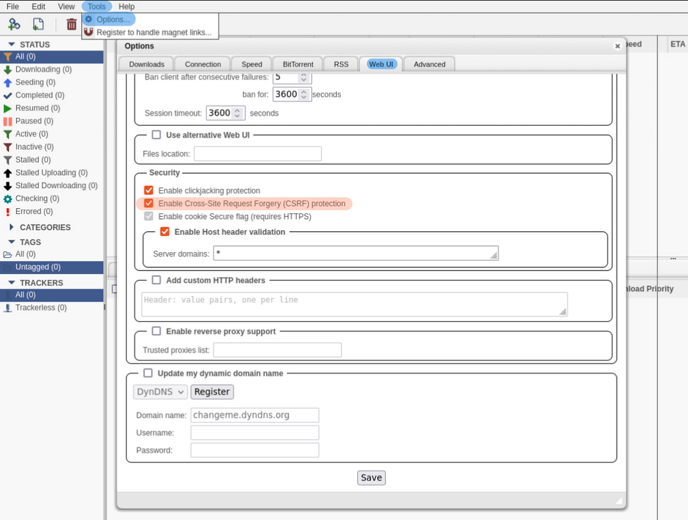

Here we keep track of the currently known issues of Homarr, reported by our community or the developers.

## 🚨 Adblocker will break and block the posters of TV shows
Many popular ad-blockers will block the posters of TV-shows in your [calendar](/docs/widgets/calendar-widget).

### Indicators
- Posters are not loading correctly
- Posters are replaced with some content from the ad-blocker

### Resolution
Please disable your ad-block for Homarr.
Most blockers will offer a switch, where you can disable them for Homarr only.

## 🚨 Docker container requires a restart after making modifications to the icons
If you are using [custom icons](/docs/customizations/icons), you might be unable to get them working in the apps.

### Indicators
- You've mounted the configuration path of Homarr
- You've uploaded / copied icons in the correct folder, [specified in our documentation](/docs/customizations/icons#adding-your-own-icons)
- You've used the icons in the apps, but they don't display

### Resolution
For the time being, restart your docker container after adding / making any changes to your icons.

## 🚨 Nginx Reverse Proxy may block Homarr's requests to several apps
If you are using [Nginx Proxy Manager](https://nginxproxymanager.com) to open Homarr instance, some features like Torrent download clients or pings, may not work.

### Indicators
- Applications have red ping status and on hover you see __Offline 403__.
- Torrents list and speed widgets dont work 

### Resolution
Open setings of Hommar instance on Nginx Proxy Manager and disable 'Block common exploits'.

## 🚨 qBittorrent webUI showing `Unauthorized`
When creating a qBittorrent tile, The qBittorrent webUI shows an Unauthorized page.

  
Screenshot

  <>
    
  <>

### Indicators
- Applications have red ping status and on hover you see __Offline 500__.
- Torrents list and speed widgets dont work 

### Resolution
- Log in to your qBittorrent webUI.
- Navigate to _Tools_ > _Options_ > _Web UI_ > _Security_.
- Uncheck __Enable Cross-Site Request Forgery (CSRF) protection__.

  
Screenshot

  <>
    
  <>

