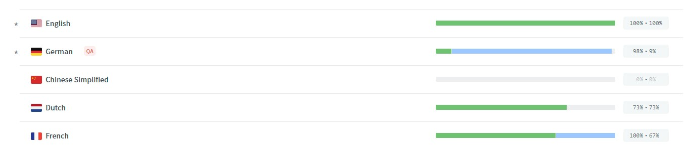
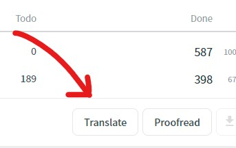

---
tags:
  - Community
  - Contributions
  - Translations
---

# Translations
We want to make Homarr accessible for as many people as possible. For that, we need your help.
We are running a community programm which enables everyone to translate Homarr into their language - no programming required.

### Where to translate
Our translation is running on https://crwd.in/homarr. You need an account to translate content into other languages.

### How to translate
#### Process
You can head over to the Crownin translations. There, you'll see what languages are currently being translated and what their progress is:

You can click on any of those languages - preferrably, one you speak fluently.
After selecting a language, you can enter the translation mode:

Depending on your device, preferences and language, the view will look a bit different.
In general, you can see the original english words and sentences on the left side.
You can enter your suggestions on the right side.

##### What happens, after I submitted translations?
After you've submitted translations, a Proofreader will review your changes. This will usually take some time, since we want to accumulate suggestions until we can choose the best variant. After a translation has been approved, it will be merged to the language development branch. We merge this one periodically to the development branch.
After the next update of Homarr, all changes from the development branch will be merged, including the changes in the translations.

:::tip

Because we can't speak any language, we also need Proofreaders. As a proofreader, you must speak a language fluently, have it as your native language or lots of experience with it. You can [let us know on our Discord](./get-in-touch.md#discord), if you belive, that you qualify as a Proofreader.

:::

#### Guidelines
1. Translate with context: Some translations can't be translated 1:1 - they need contex. Ensure that your translations make sense in the context
2. Keep things simple and original - no additional characters are needed
3. Choose the formality, that fits Homarr the best.
4. Keep your translations as near as possible to the originals