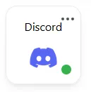
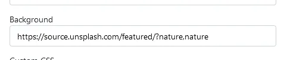

## How to get to the customize page

To get to the customize page you can click on the settings button in the right top corner of your board.

`image of settings button`

## Layout

Using the layout settings, you can customize the structure and layout of your Homarr board.

`image of layout settings`

### Sidebars

There are two sidebars available: right and left. Sidebars are additional spaces with a width of 2, that you can fill with apps or widgets - they do not support categories though.

### Pings

If you activate Pings, Homarr will send a HTTP/-S request to all your services on the page load. When the response code matches the expected status code, the ping indicator will be green. Otherwise, it will be red.

Example of an ping indicator:

---

## Access

With the allow anonymous switch you can allow / decline access for not logged in users to your board.

`image of access settings`

---

## Screen Sizes

Whenever you enter Edit Mode, a screen size indicator will appear at the bottom-right corner of the screen. You can use this indicator to see which screen size you are editing. To make your dashboard look the best, configure each screen size seperatly, making sure to save your changes before continuing to the next size.

To change the screen size you are editing, simply resize the browser.

| Screen Size | Breakpoint | Amount of Columns |
|-------------|------------|-------------------|
| Large       | >1400px    | 10                |
| Medium      | >768px     | 6                 |
| Small       | <768px     | 3                 |

The amount of columns can be configured in the gridstack settings.

`image of gridstack settings`

---

## Page Metadata

In this section you can configure the title and meta title of your board. Additionally you can define the logo and favicon.

`image of page metadata settings`

### Page Title

The page title is the text shown in the top left corner.

`image of page title with red box around it`

### Meta Title

The meta title is the text shown in the browser tab.

`image of meta title with red box around it`

### Logo

The logo is the image shown in the top left corner.

`image of logo with red box around it`

### Favicon

The favicon is the image shown in the browser tab.

`image of favicon with red box around it`

---

## Appearance

In this section you can configure the appearance of your board.

`image of appearance settings`

### Background image

The background image is the image shown in the background of your board. You can either use an image from the internet or one from the public img directory. 
You can find out [here](https://link.to.something/) how to mount the public image directory.

`image of background image`

#### Random Backgrounds

You can get a random image from Unsplash by using their [public API](https://unsplash.com). Just add the following URL to the input field:

`https://source.unsplash.com/featured/`

:::tip
 [Topics](https://unsplash.com/t) can also be used to filter the results: `?nature,nature`
:::

Example:

### Colors & Shade

You can configure the primary and secondary color for your board. The primary color is used for things like buttons or the logo. The secondary color is mostly only used for gradients.

`image of color settings`

`image of logo with different colors`

The shade is used to configure the intensity of the primary color.

`image of an element with a low shade`

### App Opacity

The app opacity slider can be used to configure the opacity of different elements on your board.
For example it can be used to decrease the opacity of the app items so the background image is more visible.

`image of app opacity settings`

`image of board with background image and low opacity`

### Custom CSS

This textarea let's you define custom css that will be applied to your board. You can use this to customize your board even further.

`image of custom css settings`

#### Static Classes

By default, many class names will be made out of a random value, also known as a hash.
These are used internally by Mantine and can make writing custom CSS quite difficult.
The biggest issue with these hashes is, that they will be randomized each build - which means, if you update Homarr, they will change and your CSS might no longer work.
For this reason, we recommend you to avoid the random hash class-names and instead use implemented static ones, for the most important objects on your dashboard, they are easier to use and don't change.

| Classname   | Description |
| ------------------ | ------------------ |
| dashboard-app-shell | Full App (including Header) |
| dashboard-header | Header |
| dashboard-header-logo-image | Logo image |
| dashboard-header-logo-text | Header text |
| dashboard-header-search-root | Searchbar root |
| dashboard-header-search-input | Searchbar input |
| grid-stack-wrapper | Gridstack wrapper |
| grid-stack-empty-wrapper | Empty gridstack wrapper |
| dashboard-gs-category | Category |
| dashboard-gs-generic-item | App/Widget wrapper |

