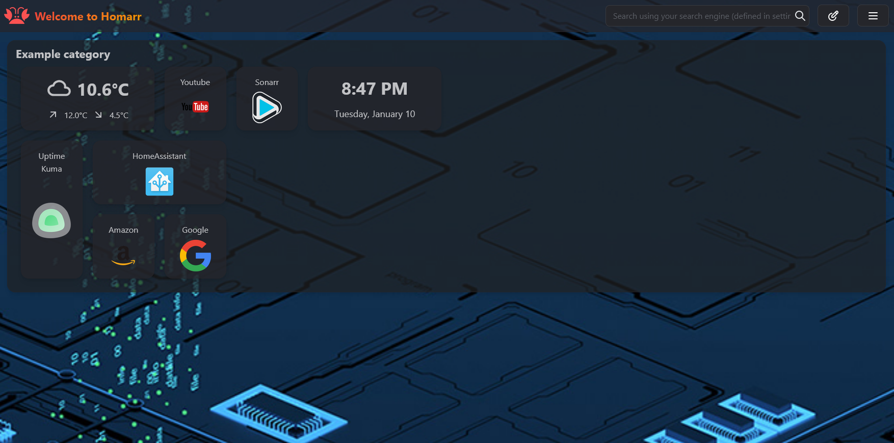

# Custom Background

To add a custom Homarr background, open the settings at the top right and click on the Tab "Customization".

:::tip

If you are using Docker, mount the path ``/app/public/`` and put the background inside of a folder called ``img``.

:::

Then, define your background in the input field:

Example with a custom background:

# Random Backgrounds

Using [Unplash](https://unsplash.com)'s public API, you are also able to set your Homarr background to a random image from their dataset by putting their URL directly in Homarr's background input field:

`https://source.unsplash.com/featured/`

:::tip
 [Topics](https://unsplash.com/t) can also be used to filter the results: `?nature,nature`
:::

Example with a random background using topics:

