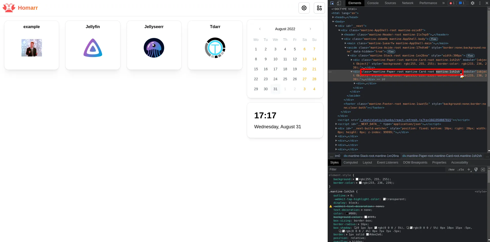

To further customize your dashboard, you can add your own CSS rules to Homarr. This can be used to change virtually any aspect of the dashboard, from the color of the background to the size of the font.

---

## Adding custom CSS rules

To add custom CSS rules, go to the Customizations tab in the settings menu. There you can find a text field where you can enter your CSS rules.

After entering your rules, click on the "Submit" button to save your changes. You can now directly see the result of your customizations on the dashboard.

### Example

---

## Finding the class names of elements

When writing CSS you will be required to use class names to select the elements you want to customize. To find the class names of the elements you want to customize, you can use the browser's developer tools. To open the developer tools, right-click on the page and select "Inspect" or "Inspect Element" from the context menu.

This opens up the DevTools of your browser. In the DevTools, you can find the Element Picker in the top left corner. Click on the Element Picker to activate it.

Now you can hover over the elements you want to customize. The element you are hovering over will be highlighted. If you click on the element, the DevTools will show you the classname of the element.

Finally, select the classname of the element you want to customize and add it to your CSS rules.

---

### Static Classes

By default, many class names will be made out of a random value, also known as a hash.
These are used internally by Mantine and can make writing custom CSS quite difficult.
The biggest issue with these hashes is, that they will be randomized each build - which means, if you update Homarr, they will change and your CSS might no longer work.
For this reason, we recommend you to avoid the random hash class-names and instead use implemented static ones, for the most important objects on your dashboard, they are easier to use and don't change.

| Classname   | Description |
| ------------------ | ------------------ |
| dashboard-app-shell | Full App (including Header) |
| dashboard-header | Header |
| dashboard-header-logo-root | Logo wrapper |
| dashboard-header-logo-image | Logo image |
| dashboard-header-logo-text | Header text |
| dashboard-header-group-right | Right group of the Header |
| dashboard-header-search-root | Searchbar root |
| dashboard-header-search-input | Searchbar input |
| grid-stack-wrapper | Gridstack wrapper |
| grid-stack-empty-wrapper | Empty gridstack wrapper |
| dashboard-gs-category-item | Category |
| dashboard-app-title | App Title |
| dashboard-gs-generic-item | App/Widget wrapper |

:::tip

Please see the [Mantine Docs](https://mantine.dev/) for more information. Homarr uses Mantine as their component library.

:::

## Additional resources

If you want to learn more about CSS, you can find a lot of resources on the internet. Here are some of the best ones:

- [MDN](https://developer.mozilla.org/en-US/docs/Learn/Getting_started_with_the_web/CSS_basics)
- [W3Schools](https://www.w3schools.com/css/)
