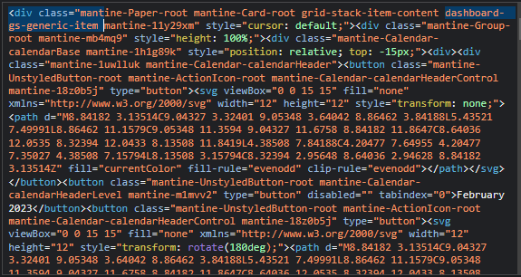

To further customize your dashboard, you can add your own CSS rules to Homarr. This can be used to change virtually any aspect of the dashboard, from the color of the background to the size of the font.

---

## Adding custom CSS rules

To add custom CSS rules, go to the Customizations tab in the settings menu. There you can find a text field where you can enter your CSS rules.


After entering your rules, click on the "Submit" button to save your changes. You can now directly see the result of your customizations on the dashboard.

### Example


### Example: Background image blur

``` 
body {
  backdrop-filter: blur(60px);
  -webkit-backdrop-filter: blur(60px);
}
```
Adding the above to your custom CSS will give you blur support for both desktop and mobile. You can change how much blur is wanted by changing the (60px) to a choice that better suits your needs. 


We can also add blur support for the settings modal. Here is an example of how we can achieve this.

```
.mantine-w4dwz9 {
  backdrop-filter: blur(5px);
  -webkit-backdrop-filter: blur(5px);
  background-color: transparent;
}
```


### Example: border colors

Here is another example for adding borders too your apps and widgets.

```
.mantine-y31s44 {
  border-color: cyan;
  border-style: groove;
}
```


## Static classnames

Implementing static classnames makes it so that homarr will no longer break your custom css due too the classname of .mantines being randomly generated with every update. Manually defining the classname of the elements makes it too where they are static and will not change during a update. While as of now homarr doesnt support having all mantines static, we now have 13 that are. Homarr plans to support more in the future.



:::note

We used too use ```.mantine-11y29xm``` but now we can also use ```.dashboard-gs-generic-item```

:::

## Examples

:::info

You can still use the .mantines instead of the static names. This is important for those that would want widgets to be a different background then applications.

:::


## Classnames statically supported

| Classnames   | Description |
| ------------------ | ------------------ |
| dashboard-app-shell | This would be for the entire app shell including the header |
| dashboard-header | The header for mantine |
| dashboard-header-logo-root | The wrapper for the logo of homarr |
| dashboard-header-logo-image | The image element of the logo |
| dashboard-header-logo-text | The text displayed in the header |
| dashboard-header-group-right | The right group of the header |
| dashboard-header-search-root | The root element of the searchbar |
| dashboard-header-search-input | The input element of the searchbar |
| grid-stack-wrapper | The gridstack wrapper |
| grid-stack-empty-wrapper | The empty gridstack wrapper |
| dashboard-gs-category-item | The categories |
| dashboard-app-title | The title of the app |
| dashboard-gs-generic-item | The generic wrapper for both apps and widgets |

---

## Finding the class names of elements

When writing CSS you will be required to use class names to select the elements you want to customize. To find the class names of the elements you want to customize, you can use the browser's developer tools. To open the developer tools, right-click on the page and select "Inspect" or "Inspect Element" from the context menu.


This opens up the DevTools of your browser. In the DevTools, you can find the Element Picker in the top left corner. Click on the Element Picker to activate it.


Now you can hover over the elements you want to customize. The element you are hovering over will be highlighted. If you click on the element, the DevTools will show you the classname of the element.


Finally, select the classname of the element you want to customize and add it to your CSS rules.


---

## Additional resources

If you want to learn more about CSS, you can find a lot of resources on the internet. Here are some of the best ones:

- [MDN](https://developer.mozilla.org/en-US/docs/Learn/Getting_started_with_the_web/CSS_basics)
- [W3Schools](https://www.w3schools.com/css/)
