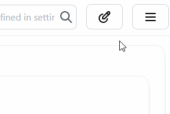

## Enabling Dark Mode

To enable dark mode, go to the settings and toggle the switch for dark mode.

:::tip

You can use the keyboard shortcut <kbd>WIN</kbd> + <kbd>J</kbd> to easily toggle the dark mode.

:::

:::info

Homarr does not currently allow you too set dark mode as the default, this means that sometimes when loading homarr after restart it will be reverted back to "Light mode".

:::
