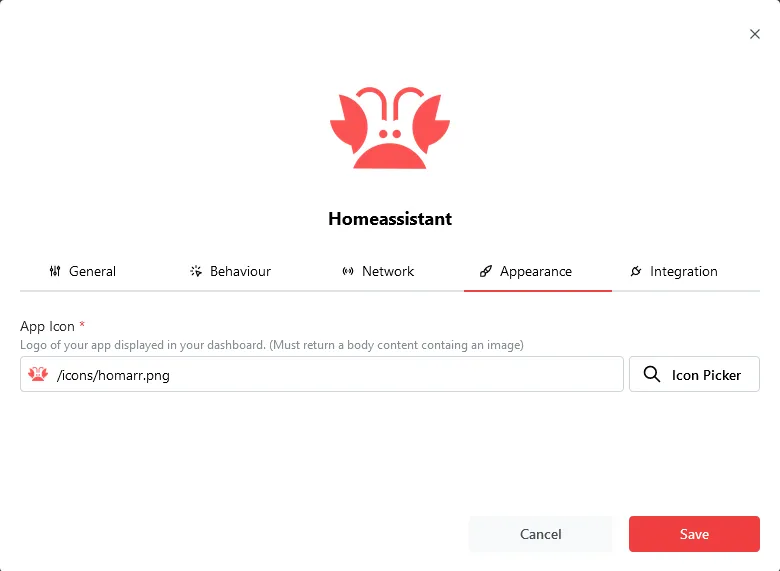

## Icon search
Icons in Homarr are automatically requested from multiple sources:
  - [Walkxcode Dashboard Icons](https://github.com/walkxcode/dashboard-icons)
  - [Tabler Icons](https://tabler-icons.io/)
  - [Papirus Icons](https://github.com/PapirusDevelopmentTeam/papirus-icon-theme)
  - [Homelab Svg Assets](https://github.com/loganmarchione/homelab-svg-assets)

If you're unable to find the icon you're looking for, you can [add your own icons](#add-your-own-icons).

---

## Add your own icons

### Mounting the icons folder
If you haven't already mounted an icons folder, please go back to the [installation docs](/docs/introduction/installation) and follow the instructions for mounting the icons folder.

### Adding your icons
Add your icons to the icons folder. The icons should be named after the app name. For example, if you want to add an icon for the app `plex`, the icon should be named `plex.webp` or `plex.svg`.

### Using your icons
Access the icon(s) using `/icons/name.webp` or `/icons/name.svg`.

:::info

Even if you mounted the icons folder in `/app/public/icons`, your custom icons should be accessed by `/icons/` directly.

:::caution

A restart is required for the icons to be loaded.

:::

:::info

If icons are not loading, make sure Homarr has the correct permissions to access the icons folder.
Running `sudo chmod -R 755 /path/to/icons` should fix the issue.

:::
