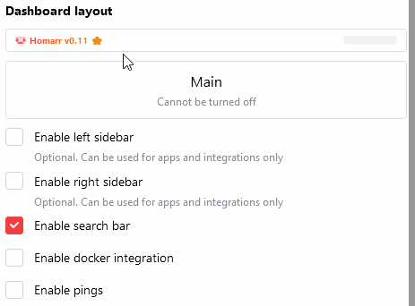
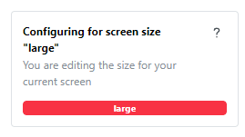
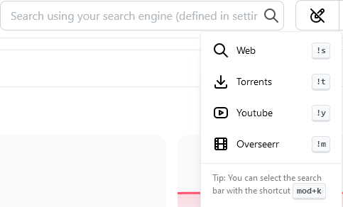
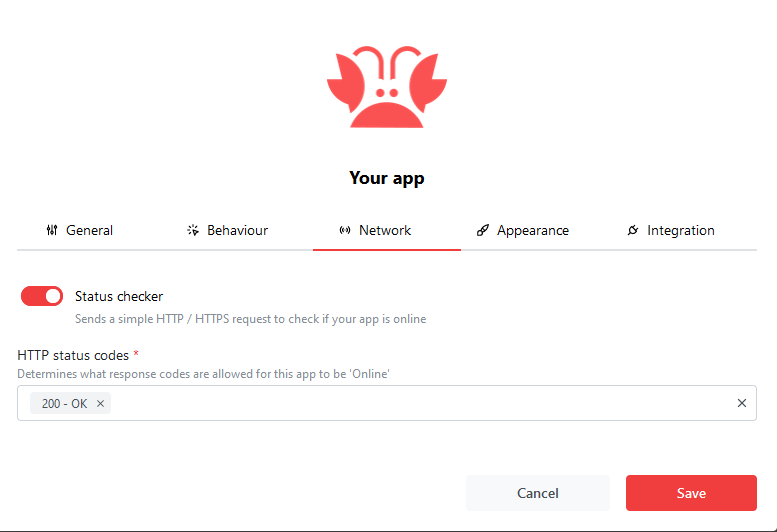
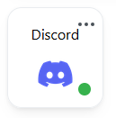

Using the layout settings, you can customize the apperance and layout of your Homarr instance.

---

## Screen Sizes

Whenever you enter Edit Mode, a screen size indicator will appear at the bottom-right corner of the screen. You can use this indicator to see which screen size you are editing. To make your dashboard look the best, configure each screen size seperatly, making sure to save your changes before continuing to the next size.

To change the screen size you are editing, simply resize the browser.

| Screen Size | Breakpoint | Amount of Columns |
|-------------|------------|-------------------|
| Large       | >1400px    | 12                |
| Medium      | >768px     | 6                 |
| Small       | <768px     | 3                 |

## Sidebars

There are two sidebars available: ``right`` and ``left``.
Sidebars are additional spaces, that you can fill with apps or widgets - they do not support categories though.

---

## Search Bar

An optional search bar can be added to your dashboard.
It enables you to search for:
- Search results on the web
- Torrents on https://www.torrentdownloads.pro/
- Youtube Videos
- Overseerr / Jellyseerr items
- The apps on your dashboard

---

## Docker Integration

The [docker integration](/docs/integrations#🐳-docker) enables you to interact with your docker containers.
Please note, that it [requires some initial setup](/docs/integrations#🐳-docker).

---

## Pings
If you activate Pings, Homarr will send a HTTP/-S request to all your services on the page load.
When the response code matches the expected status code, the ping indicator will be green. Otherwise, it will be red.

Example of an ping indicator:

