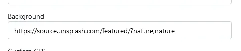

## Custom Title

To add a custom Homarr title, open the settings at the top right and click on the Tab "Customization". Then, change your title in the input field:

---

## Custom Background

To add a custom background, open the settings at the top right and click on the Tab "Customization".

:::tip

If you are using Docker, mount the path ``/app/public/img`` and put the backgrounds or custom icons inside of that folder.

A restart is required for the backgrounds to be loaded.

:::

Then, define your background in the input field:

Example:

*`App Opacity` option is below the `Background` option.*

### Random Backgrounds

You can get a random image from Unsplash by using their [public API](https://unsplash.com). Just add the following URL to the input field:

`https://source.unsplash.com/featured/`

:::tip
 [Topics](https://unsplash.com/t) can also be used to filter the results: `?nature,nature`
:::

Example:

