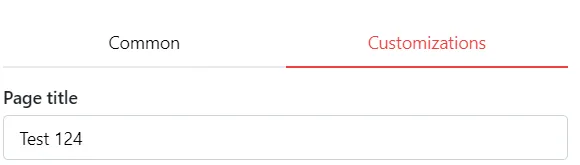
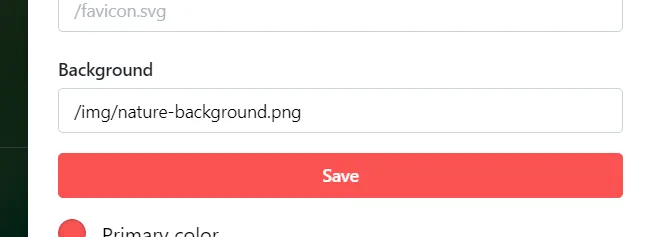
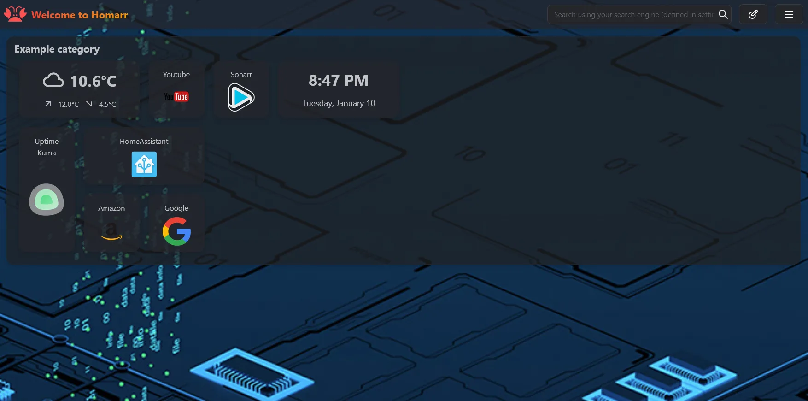

## Custom Title

To add a custom Homarr title, open the settings at the top right and click on the Tab "Customization". Then, change your title in the input field:

---

## Custom Background

To add a custom background, open the settings at the top right and click on the Tab "Customization".

:::tip

If you are using Docker, mount the path ``/app/public/img`` and put the backgrounds or custom icons inside of that folder.
The files monted in `/app/public/` are accessible with the url `/` . You will need to access your images with the url `/img/{img}.png` for example.

A restart is required for the backgrounds to be loaded.

:::

Then, define your background in the input field:

Example:

*`App Opacity` option is below the `Background` option.*

You can set images using their links when found online instead of a locally saved one as well.

---

### Dynamic Backgrounds

You can get daily or random wallpapers using wallpaper providers that gives images through HTTP(S) requests.

The element returned by that URL needs to be an image, XML and JSON won't work.

Here we have the APIs already tested within the community.

#### Bing

You can get Bing's daily image fetched through [TimothyYe's API](https://github.com/TimothyYe/bing-wallpaper)

Using the following link:

`https://bing.biturl.top/?resolution=1920&format=image&index=0&mkt=zh-CN`

:::tip
The elements of the URL can be changed to a certain extent:
  - `resolution` Amount of horizontal pixels (Not vertical like resolutions for videos, so 1080p = 1920 for exemple)
  - `format` json or image. For a CSS implementation, the image format is required and what needs to be used in homarr for it to work.
  - `index` Being a daily image, you can choose the numbers of days before the current day you want to get the image from, 0 being today and 7 (the max) being last week's. Setting it to random will give you any of the wallpapers from 7 days ago to today's.
  - `mkt` Selects a zone/country for more local images. (language-country. Not all country codes will work. You can most likely find yours or a neighboring one [here](https://www.andiamo.co.uk/resources/iso-language-codes/) )

Note:
None of those elements are necessary to get the daily image except the format one, thus you can simply use the link:

`https://bing.biturl.top/?format=image`

Doing this will use the default values of 1920x1080, today's image and the Chinese region.

Omitting any of the elements will use it's said default value.
:::
