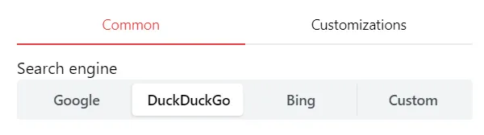
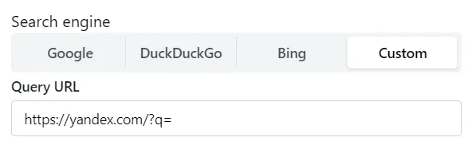

## Select a search engine

Homarr has a collection of search engines pre-configured. You can select one of them from the settings.
To change the search engine, go to the settings and select the search engine you'd like to use.

---

## Configure a custom search engine

You can also configure a custom search engine.

Homarr let's you use any search engine you'd like. You can use your own self-hosted search engine or any other search engine that you'd like to use.
Choose "Custom" from the collection of search engines.

Then, enter the URL of the search engine you'd like to use. Homarr will append the search query to the end of the URL.

:::tip

You can use the `%s` placeholder in the URL to indicate where the search query should be placed. For example, if you'd like to use Yandex as your search engine, you can use the following URL: `https://yandex.com/search/?text=%s` and Homarr will replace `%s` with the search query.

:::
