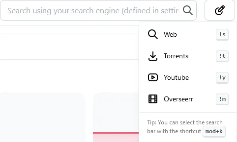
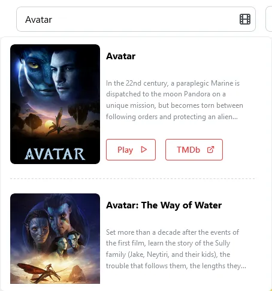
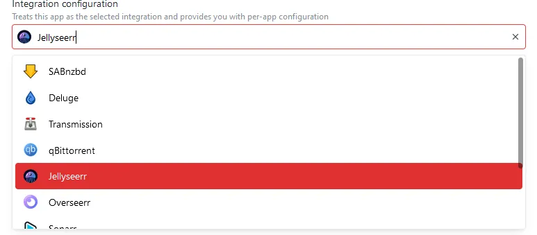
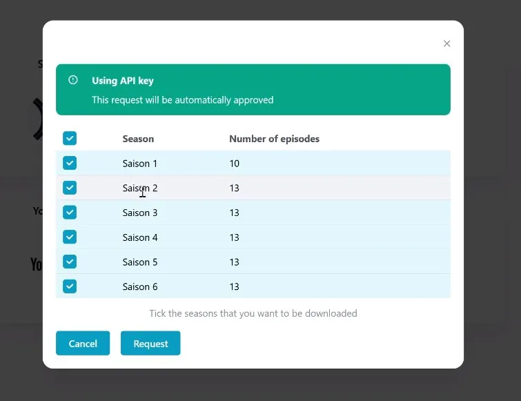
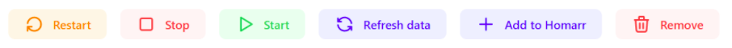
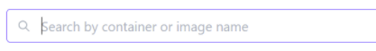
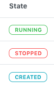
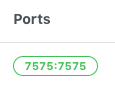

import Tabs from '@theme/Tabs';
import TabItem from '@theme/TabItem';

Homarr will integrate with a ton of different apps on your system.

- [Torrent Clients](#torrent-clients)
  - [Deluge](#deluge)
  - [Transmission](#transmission)
  - [qBittorrent](#qbittorrent-integration)
- [Usenet Clients](#usenet-clients)
  - [SABnzbd](#sabnzbd)
  - [NZBGet](#nzbget)
- [Collection Managers](#collection-managers)
  - [Sonarr](#sonarr) (series)
  - [Radarr](#radarr) (movies)
  - [Lidarr](#lidarr) (music)
  - [Readarr](#readarr) (books)
- [Media Servers](#media-servers)
  - [Jellyfin](#jellyfin)
  - [Plex](#plex)
- [Dash.](#dash)
- [Overseerr & Jellyseerr](#overseerr--jellyseerr) (media requests)
- [Docker](#docker)

:::caution

Homarr usually does not support ``beta``, ``alpha`` or older legacy versions of integrations, because new versions often contain breaking API changes.
We will not support these, because the underlying API often changes frequently and would require much attention for very little outcome.

:::

## Torrent Clients

Homarr supports a total of 3 Torrent clients.
You can use them to display your torrents directly on your dashboard and see if you are leeching / seeding.

### Deluge
The Deluge integration is used by the following widgets:

- [Torrent](/docs/widgets/torrent-widget)
- [Download Speed](/docs/widgets/download-speed-widget)

  

  Available configuration options
  

  

| Field    | Type    | Description |
| -------- | ------- | ----------- |
| Password | Private | Used for authenticating with the Deluge service |

  

### Transmission
The Transmission integration is used by the following widgets:

- [Torrent](/docs/widgets/torrent-widget)
- [Download Speed](/docs/widgets/download-speed-widget)

  

  Available configuration options
  

  

| Field    | Type    | Description |
| -------- | ------- | ----------- |
| Username | Private | Username used for authentication |
| Password | Private | Password used for authentication |

  

### qBittorrent Integration
The qBittorrent integration is used by the following widgets:

- [Torrent](/docs/widgets/torrent-widget)
- [Download Speed](/docs/widgets/download-speed-widget)

  

  Available configuration options
  

  

| Field    | Type    | Description |
| -------- | ------- | ----------- |
| Username | Private | Username used for authentication |
| Password | Private | Password used for authentication |

  

Please note the known issue with qBittorrent:
[qBittorrent webUI showing Unauthorized](./../community/known-issues.mdx#🚨-qbittorrent-webui-showing-unauthorized)

---

## Usenet Clients

### SABnzbd

The [SABnzbd](https://sabnzbd.org/) integration directly communicates with your download client and enables you to view and control your downloads directly from Homarr.
You can use this integration from the [Usenet Widget](/docs/widgets/usenet-widget).

  

  Available configuration options
  

  

| Field    | Type    | Description |
| -------- | ------- | ----------- |
| ApiToken | Private | Token used for authentication |

  

### NZBGet

The [NZBGet](https://nzbget.net/) integration directly communicates with your download client and enables you to view and control your downloads directly from Homarr.
You can use this integration from the [Usenet Widget](/docs/widgets/usenet-widget).

  

  Available configuration options
  

  

| Field    | Type    | Description |
| -------- | ------- | ----------- |
| Username | Private | Username used for authentication |
| Password | Private | Password used for authentication |

  

---

## Collection Managers
### Sonarr

Homarr will integrate the shows of your [Sonarr](https://sonarr.tv/) calendars in the [Calendar Widget](/docs/widgets/calendar-widget)

  

  Available configuration options
  

  

| Field    | Type    | Description |
| -------- | ------- | ----------- |
| ApiToken | Private | Token used for authentication |

  

### Radarr

Homarr will integrate the shows of your [Radarr](https://radarr.video/) calendars in the [Calendar Widget](/docs/widgets/calendar-widget)

  

  Available configuration options
  

  

| Field    | Type    | Description |
| -------- | ------- | ----------- |
| ApiToken | Private | Token used for authentication |

  

### Lidarr

Homarr will integrate the shows of your [Lidarr](https://lidarr.audio/) calendars in the [Calendar Widget](/docs/widgets/calendar-widget)

  

  Available configuration options
  

  

| Field    | Type    | Description |
| -------- | ------- | ----------- |
| ApiToken | Private | Token used for authentication |

  

### Readarr

Homarr will integrate the shows of your [Readarr](https://readarr.com/) calendars in the [Calendar Widget](/docs/widgets/calendar-widget)

  

  Available configuration options
  

  

| Field    | Type    | Description |
| -------- | ------- | ----------- |
| ApiToken | Private | Token used for authentication |

  

---

## Media Servers
Homarr can integrate with your media servers, which allows you to control it from your dashboard.
You may add multiple media servers, also of different kinds, to your dashboard.

:::tip

We recommend creating a separate account just for Homarr. Only grant access to the libraries and permissions that you require to be accessed by Homarr. This allows for better security.

:::

### Jellyfin
The Jellyfin integration enables you to view the active sessions, using the [Media Server widget](../widgets/media-server), on your dashboard.

  

  Available configuration options
  

  

| Field    | Type    | Description |
| -------- | ------- | ----------- |
| Username | Private | Username used for authentication |
| Password | Private | Password used for authentication |

  

### Plex
The Plex integration enables you to view the active sessions, using the [Media Server widget](../widgets/media-server), on your dashboard.

  

  Available configuration options
  

  

| Field    | Type    | Description |
| -------- | ------- | ----------- |
| ApiToken | Private | Token used for authentication |

  

---

## Dash.

The Dash. integration can be used to monitor the performance and used system resources of your machine.
Dash. will be used in the [Dash.](/docs/widgets/dashdot-widget)

---

## Overseerr & Jellyseerr
The [Overseerr](https://overseerr.dev/) integration will enable you to request movies and series directly from your Homarr dashboard.

After choosing the correct type, you can search for content:

It displays, which content is already in your Overseerr library and links available content directly to your [Plex](https://www.plex.tv/) or [Jellyfin](https://jellyfin.org/) instance.

  

  Available configuration options
  

  

| Field    | Type    | Description |
| -------- | ------- | ----------- |
| ApiToken | Private | Token used for authentication |

  

### Initial setup
#### Installation of Media Server
The Overseer integration supports both Overseerr and Jellyseerr, a fork of Overseerr compatible with Jellyfin.

<Tabs groupId="media-server">
  <TabItem value="plex" label="🎬 Plex Media Server">
    

      Install Plex on your machine using your preferred installation method: <a href="https://www.plex.tv/">https://www.plex.tv/</a> 
      We recommend the installation using Docker for the easiest and fastest installation.
    

  </TabItem>
  <TabItem value="jellyfin" label="🎬 Jellyfin Media Server">
    

      Install Jellyfin on your machine using your preferred installation method: <a href="https://jellyfin.org/docs/general/administration/installing.html">https://jellyfin.org/docs/general/administration/installing.html</a> 
      We recommend the installation using Docker for the easiest and fastest installation.
    

  </TabItem>
</Tabs>

#### Installation of Media requester

<Tabs groupId="media-server">
  <TabItem value="plex" label="🎬 Plex Media Server">
    

      After you have your Plex instance up and running, you must install Overseer as your media request application. Please read the official documentation of how to install Overseerr on your machine: <a href="https://docs.overseerr.dev/getting-started/installation">https://docs.overseerr.dev/getting-started/installation</a>.
    

  </TabItem>
  <TabItem value="jellyfin" label="🎬 Jellyfin Media Server">
    

      Officially, Jellyfin is not supported by Overseerr. This is why Jellyfin users must use a fork of the official Overseerr project, which was modified to work with Jellyfin: <a href="https://github.com/Fallenbagel/jellyseerr">https://github.com/Fallenbagel/jellyseerr</a>. 
      We recommend the installation using Docker for the easiest and fastest installation.
    

  </TabItem>
</Tabs>

#### Add your application in Homarr
If your instance of Overseerr or Jellyseerr is up and running, it's time to add it to your dashboard.
Simply select the correct type from the integration tab when editing the application:

<Tabs groupId="media-server">
  <TabItem value="plex" label="🎬 Plex Media Server">
    

      Select <code>Overseerr</code> in the app type for your Overseerr app. 
      Fill our the field <code>Api token</code> with from the link below, when having <code>Overseerr</code> as the app type selected.
    

  </TabItem>
  <TabItem value="jellyfin" label="🎬 Jellyfin Media Server">
    

      Select <code>Jellyseerr</code> in the app type for your Jellyseerr app. 
      Fill our the field <code>Api token</code> with from the link below, when having <code>Jellyseerr</code> as the app type selected.
    

  </TabItem>
</Tabs>

### Searching for a movie / series
To search for a movie or series, simply press ``CTRL`` + ``K`` or click into the search box.
Then, type ``!os`` (with a space at the end) and enter, what you want to search for.

The integration will display, what content is already available in your media library.

### Seasons selection
If you're selecting a series, you'll be asked what seasons you want to request:

---

## Docker

Homarr allows you to interact with Docker containers running on your system.

You can **restart**, **stop**, **start**, **refresh** and **remove** containers as well as **add** them to the Homarr dashboard

Additionally, if you have a lot of containers you can search and filter them by **container** or **image** name

View the state of each container (**created**, **running** or **stopped**)

And also check what ports the container has exposed (container port:external port)

### Before you begin
In order for Homarr to be able to interact with your Docker instance you must tell Homarr the path to your Docker socket.  You do this by adding the following to the Docker command when you first run Homarr:

`-v /var/run/docker.sock:/var/run/docker.sock`

If you are running Docker Desktop on Windows 10, use the following path to your Docker socket:

`-v //var/run/docker.sock:/var/run/docker.sock`
