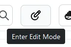
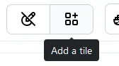
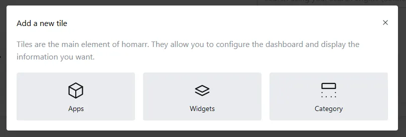
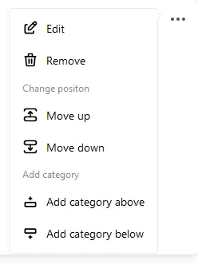
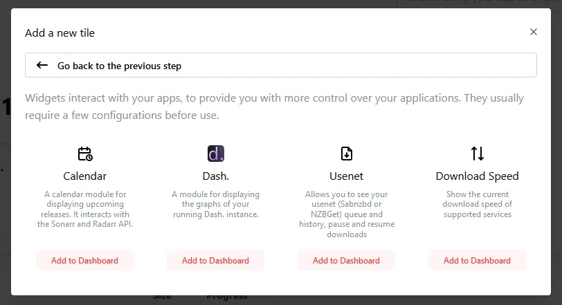
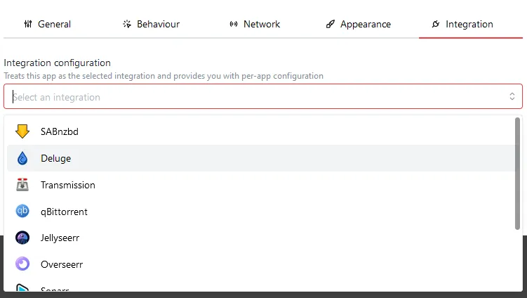

Congratulations! You've installed Homarr. Now, it's time to configure it to **your** liking. This guide will help you get started with Homarr.

---
## Creating the administator account
Let's begin by creating the administrator account. This account will be used to manage your dashboard. Simply follow the onboarding steps and enter the required information.

After this step, you can click continue and go to your board.

---

## Entering Edit Mode
You can adjust your dashboard by going into ***✨ Edit Mode ✨***. In Edit Mode, you can move, edit and delete tiles.

You can enter Edit Mode using this button, which is located at the top right of your screen:

When you enter Edit Mode, you will see a few changes:

- Tiles will have their own menu, where you can make changes to them.
- A "Add a Tile" button will appear next to the "Edit Mode" button.
- A popup will appear on the bottom left of the screen with some useful information.

:::caution

Changes are only saved when you exit Edit Mode. If you leave the page without exiting Edit Mode, your changes will be lost.

:::

---

## Adding your first app
In homarr, apps are the key concept, an app is a tile on your dashboard that links to an external application, it can be connected via an integration, for more information about the terms we will use please take a look at the [glossary](/docs/introduction/glossary).

Let's begin by adding your first app to Homarr. [Enter Edit Mode](#entering-edit-mode) and click on the Add a Tile button:

A popup will appear, where you can choose the type of tile you want to add. For now, we'll choose "Apps":

Another popup will appear, where you can enter the details of your app. You can also [choose an icon](/docs/customizations/icons) for your app:

The following fields are required:

- App Name
- Internal address
- App Icon *(Will be automatically grabbed if possible.)*

:::note What's the internal address? 

> The internal URL defines how Homarr should communicate to the application, it is the address that will be used by integrations in order to communicate with 3rd party services, it is often an IP address so that Homarr can communicate with the application inside your network, bypassing any layers on top of it (eg. reverse proxy, auth)

> If you have any problems, the "Having issues?" button will give you basic steps of troubleshooting.

From the [glossary](/docs/introduction/glossary)
:::

---

## Organizing and re-arranging your dashboard

After you've added a few apps, it's time to organize and re-arrange your dashboard. While Edit Mode is active, the following changes will be made to the tiles.

- A menu will appear on the top right of the tile. This menu can be used to edit or delete the tile.
- A resize arrow will appear on the bottom right of the tile. Click (hold) and drag to resize the tile.
- Tiles are movable. Click (hold) and drag to move the tile.

---

## Adding categories

You can add categories to your dashboard. Categories are useful for organizing your apps. Click the "Add a new tile" button and choose "Category":

Tiles can be organized into categories. Simply drag and drop the tile into the category.

Each category will have it's own menu, allowing you to change it's position and name, to delete it, or to add a new category below/above.

---

## Adding widgets

You can further extend the functionality of your dashboard by adding widgets. Widgets are used to display information from your apps. For example, you can add a widget that displays the current weather. Widgets can also be interactive, allowing you to control external apps or services from your dashboard.

Click the "Add a new tile" button and choose "Widget":

Click on the widget you want to add. You can choose from a variety of widgets:

:::tip

Wigets can be organized the same way as apps can be. Please note that some widgets require additional configuration before they can be used.

:::

Integrations are configured using the "Integration" tab when Editing/Adding a widget. You can [choose from a variety of integrations](/docs/integrations).

After choosing an integration type, you can configure the integration. For example, if you choose the "Weather" integration, you will be able to configure the location of the weather widget.

:::caution

Two types of values are used. ``private`` and ``public``. Public values should not contain passwords or tokens, as they are being sent to the client. Private values will only be sent one time, and will never be used after exiting Edit Mode. For this reason, you won't be able to read the values of your private credentials after setting them.

:::

:::danger

The Homarr Team will never ask for your credentials. Do not send people your credentials, as they manage the access to your applications and can cause harm to your device if they are abused.

:::
