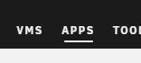

import Tabs from '@theme/Tabs';
import TabItem from '@theme/TabItem';

# 🚀 Installation

Homarr can be installed trough 3 different methods. For most users, [the installation using Docker](#-installation-using-docker) will be sufficient and the easiest.

## 🐋 Installation using Docker

Docker is a free Software that isolates Homarr using containers. Using Docker, you can run Homarr on any supported plattform (including Windows and Raspberry Pi), without running any installers or linux knowledge.

### Initial Installation

To add the Homarr container via Docker, simply run the following command in your terminal.

```bash
docker run  \
  --name homarr \
  --restart unless-stopped \
  -p 7575:7575 \
  -v <your-path>/homarr/configs:/app/data/configs \
  -v <your-path>/homarr/icons:/app/public/icons \
  -d ghcr.io/ajnart/homarr:latest
```

:::note

Docker will mount the configuration files and icons to your host machine. Please make sure to replace ``<your-path>`` from the docker run command with your desired storage location. The path must be absolute.

:::

### Updating Homarr
To update Homarr, you must remove your container first. Make sure that you've mounted your data and that you have access to it, so your configuration doesn't get lost.

Run ``docker rm homarr`` to remove the container.
Then, update the Homarr image (requires network connection): ``docker pull ghcr.io/ajnart/homarr:latest``.
After that, run the same command as before when you installed Homarr.

This process can get tideous, if you update frequently. Thus, we recommend [the installation using docker-compose](#-installation-using-docker-compose-or-portainer) for more experienced users.

## 🐋 Installation using Docker Compose or Portainer

For advanced users, we recommend installation using ``docker-compose`` or [Portainer](https://www.portainer.io/).

```yml title="docker-compose.yml"
version: '3'
#---------------------------------------------------------------------#
#                Homarr -  A homepage for your server.                #
#---------------------------------------------------------------------#
services:
  homarr:
    container_name: homarr
    image: ghcr.io/ajnart/homarr:latest
    restart: unless-stopped
    volumes:
      - ./homarr/configs:/app/data/configs
      - ./homarr/icons:/app/public/icons
    ports:
      - '7575:7575'
```

If you're not using Portainer, you can start the service using ``docker-compose up -d`` in the same directory.

<br/>

#### Using Traefik to secure Homarr
Copying the configuration straight from the docker-compose file won't work if you are running homarr behind Traefik, such as a Portainer setup, or docker-swarm. In that case, you should use the following slightly modified configuration:
```yaml
version: '3'
services:
  homarr:
    container_name: homarr
    image: ghcr.io/ajnart/homarr:latest
    restart: unless-stopped
    volumes:
      - ./homarr/configs:/app/data/configs
      - ./homarr/icons:/app/public/icons
    environment:
      - BASE_URL=your.internal.dns.address.here.com
    networks:
      - proxy
    labels:
      traefik.enable: true
      traefik.http.routers.homarr.rule: Host(`your.internal.dns.address.here.com`)
      traefik.http.routers.homarr.entrypoints: websecure
      traefik.http.routers.homarr-secure.service: homarr
      traefik.http.services.homarr.loadbalancer.server.port: 7575

networks:
  proxy:
    external: true
```

<br/>

A sample Traefik docker-compose.yml using Cloudflare for certificate generation that works with the configuration above would be:
```yaml
version: '3'

services:
  traefik:
    image: traefik:latest
    container_name: traefik
    restart: unless-stopped
    security_opt:
      - no-new-privileges:true
    networks:
      - proxy
    ports:
      - 80:80
      - 443:443
    environment:
      - CF_API_EMAIL=yourcfemail@here.com
      - CF_DNS_API_TOKEN=long-token-from-cf

    command:
      - "--log.level=DEBUG"
      - "--providers.docker=true"
      - "--providers.docker.exposedbydefault=false"
      - "--providers.docker.endpoint=unix:///var/run/docker.sock"
      - "--entrypoints.web.address=:80"
      - "--entrypoints.web.http.redirections.entryPoint.to=websecure"
      - "--entrypoints.web.http.redirections.entryPoint.scheme=https"
      - "--entrypoints.web.http.redirections.entrypoint.permanent=true"
      - "--entrypoints.websecure.address=:443"
      - "--entrypoints.websecure.http.tls.certResolver=cloudflare"
      - "--certificatesresolvers.cloudflare.acme.storage=acme.json"
      - "--certificatesResolvers.cloudflare.acme.email=yourcfemail@here.com"
      - "--certificatesResolvers.cloudflare.acme.dnsChallenge=true"
      - "--certificatesResolvers.cloudflare.acme.dnschallenge.provider=cloudflare"
      - "--certificatesResolvers.cloudflare.acme.dnschallenge.resolvers=1.1.1.1:53,1.0.0.1:53"
      - "--serversTransport.insecureSkipVerify=true" # Or proxmox gives an error 500 due to its own self-signed cert

    volumes:
      - /etc/localtime:/etc/localtime:ro
      - /var/run/docker.sock:/var/run/docker.sock:ro
      - ./data/acme.json:/acme.json

networks:
  proxy:
    external: true
```


:::tip
Of particular note here is that both configurations explicitly define which network they are using, in this case "proxy", but it can be named anything. It just has to be the same across all services for which Traefik is serving as a proxy. These are marked as external because the proxy network was manually created by running: `docker network create proxy` but this might be unecessary depending on HOW exactly you are running Traefik. For example, if running [Traefik with Portainer](https://docs.portainer.io/advanced/reverse-proxy/traefik#deploying-in-a-docker-standalone-scenario), you can follow their official docs on how to setup Traefik and Portainer together, and you can just focus on the homarr docker labels instead.
:::


## 🛒 Install from the Unraid Community App Store
You can install Unraid without ``docker run`` and ``docker-compose``, directly from your Unraid Web Dashboard.

### Install the Comunity Apps Plugin

First, you need to install the Community Apps Plugin, if you haven't already done so.

<a
  href="https://forums.unraid.net/topic/38582-plug-in-community-applications/"
  style={{
    backgroundColor: 'var(--ifm-color-primary)',
    borderRadius: '2px',
    color: '#fff',
    padding: '0.4rem 2rem',
    textDecoration: 'none'
  }}>
  Open Installation Guide
</a>

<br/>
<br/>

:::tip
If you're unsure whether you have the plugin installed or not, search for this tab in the navigation:


:::

### Install Homarr from the Community Apps
Next, click on ``Apps``, wait until the page has fully loaded and then search for ``Homarr`` in the search box.


Click on Install and adjust the settings to your liking.
After you click submit, Unraid will automatically start the installation. You can find Homarr under the tab "Docker" afterwards.

## 💻 Building from source
:::tip

Installing from source is not recommended, if you don't know what you're doing and/or are not planning to make changes to the source code, please install Homarr using [Docker](#-installation-using-docker).

:::

<Tabs>
  <TabItem value="orange" label="Yarn Package Manager" default>
    <ul>
      <li>Clone the Repository using <code>git clone https://github.com/ajnart/homarr.git</code></li>
      <li>Enter the created directory using <code>cd homarr</code></li>
      <li>Install all dependencies using <code>yarn install</code></li>
      <li>Build the source using <code>yarn build</code></li>
      <li>Start the NextJS web server using <code>yarn start</code></li>
    </ul>
  </TabItem>
  <TabItem value="apple" label="NPM Package Manager">
    <ul>
      <li>Clone the Repository using <code>git clone https://github.com/ajnart/homarr.git</code></li>
      <li>Enter the created directory using <code>cd homarr</code></li>
      <li>Install all dependencies using <code>npm install</code></li>
      <li>Build the source using <code>npm build</code></li>
      <li>Start the NextJS web server using <code>npm start</code></li>
    </ul>
  </TabItem>
</Tabs>

## Troubleshooting your Installation

If you are having trouble getting Homarr to install properly on your system, check out our [FAQ page](https://homarr-docs.vercel.app/docs/community/frequently-asked-questions).
When you are still not able to get Homarr up and running, contact us on [our official Discord](https://discord.gg/aCsmEV5RgA)
