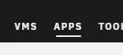
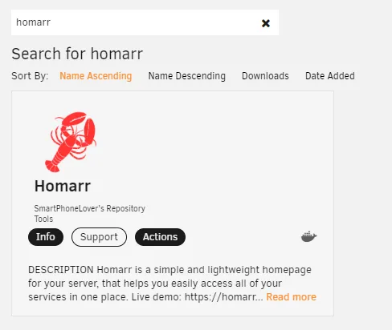

import Tabs from '@theme/Tabs';
import TabItem from '@theme/TabItem';

Homarr can be installed in many ways. For most users, [Installation using Docker](#-installation-using-docker) will be sufficient and the easiest.

---

## Installation using Docker

Docker is a free Software that isolates Homarr using containers. Using Docker, you can run Homarr on any supported platform (including Windows and Raspberry Pi), easily.

### Prerequisites

- [Docker](https://docs.docker.com/get-docker/)

### Installation

To install Homarr using Docker, simply run the following command.

```bash
docker run  \
  --name homarr \
  --restart unless-stopped \
  -p 7575:7575 \
  -v <your-path>/homarr/configs:/app/data/configs \
  -v <your-path>/homarr/icons:/app/public/icons \
  -d ghcr.io/ajnart/homarr:latest
```

:::note

Docker will mount the configuration files and icons to your host machine. Please make sure to replace ``<your-path>`` from the docker run command with your desired storage location. The path must be absolute.

:::

### Updating
To update Homarr, you must remove your container first. Make sure that you've mounted your data and that you have access to it, so your configuration doesn't get lost.

1. Run ``docker rm homarr`` to remove the container.
2. Pull the latest Homarr image ``docker pull ghcr.io/ajnart/homarr:latest``.
3. Re-run the command you used to install Homarr.

This process can get tideous, if you update frequently. Thus, we recommend [the installation using docker-compose](#-installation-using-docker-compose-or-portainer) for more experienced users.

:::tip

Want to update all your containers automatically? Checkout [Watchtower](https://containrrr.dev/watchtower/) a service which will automatically update your containers on a set interval.

:::

---

## Installation using Docker Compose or Portainer Stacks

### Prerequisites
- [Docker Compose](https://docs.docker.com/compose/install/) or [Portainer Stacks](https://www.portainer.io/blog/stacks-docker-compose-the-portainer-way)

### Installing

<Tabs>
  <TabItem value="compose" label="Docker Compose">

To install Homarr using Docker Compose, simply create a file called ``docker-compose.yml`` and paste the following code into it.

```yml title="docker-compose.yml"
version: '3'
#---------------------------------------------------------------------#
#     Homarr - A simple, yet powerful dashboard for your server.     #
#---------------------------------------------------------------------#
services:
  homarr:
    container_name: homarr
    image: ghcr.io/ajnart/homarr:latest
    restart: unless-stopped
    volumes:
      - ./homarr/configs:/app/data/configs
      - ./homarr/icons:/app/public/icons
    ports:
      - '7575:7575'
```

Then, run ``docker-compose up -d`` in the same directory. This will start the Homarr container in the background.

  </TabItem>

  <TabItem value="portainer" label="Portainer Stacks">

To install Homarr using Portainer Stacks, simply create a new stack and paste the following code into it.

```yml title="docker-compose.yml"
version: '3'
#---------------------------------------------------------------------#
#     Homarr - A simple, yet powerful dashboard for your server.     #
#---------------------------------------------------------------------#
services:
  homarr:
    container_name: homarr
    image: ghcr.io/ajnart/homarr:latest
    restart: unless-stopped
    volumes:
      - <your-path>:/app/data/configs
      - <your-path>:/app/public/icons
    ports:
      - '7575:7575'
```


:::note

Portainer will mount the configuration files and icons to your host machine. Please make sure to replace ``<your-path>`` from the docker run command with your desired storage location. The path must be absolute.

:::

Then, click on ``Deploy the stack`` and wait until the container has started.

:::tip

If you're unsure how to create a stack, checkout the [Portainer Documentation](https://docs.portainer.io/user/docker/stacks/add).

:::

  </TabItem>

</Tabs>

### Updating

To update Homarr using Docker Compose or Portainer Stacks, simply pull the latest image and restart the container.

1. Run ``docker pull ghcr.io/ajnart/homarr:latest`` to pull the latest image.
2. Re-run ``docker-compose up -d`` or re-deploy the stack in Portainer.

---


## Installation using the Unraid Community App Store
You can install Homarr directly from your Unraid Dashboard, no terminal required.

### Prerequisites

- [Unraid](https://unraid.net/)
- [Community Apps](https://forums.unraid.net/topic/38582-plug-in-community-applications/)

### Install the Community Apps Plugin

<a
  href="https://forums.unraid.net/topic/38582-plug-in-community-applications/"
  style={{
    backgroundColor: 'var(--ifm-color-primary)',
    borderRadius: '0.5rem',
    color: '#fff',
    padding: '0.4rem 2rem',
    textDecoration: 'none'
  }}>
  Open Installation Guide
</a>

<br/>
<br/>

:::tip

Don't know whether you have the plugin installed or not? Search for this tab in the navigation:


:::

### Installing

After you've installed the Community Apps Plugin, you can install Homarr from the Unraid Dashboard.

1. Navigate to the tab "Apps".
2. Search for "Homarr" and click on the result.
3. Click on "Install" and adjust the settings to your liking.



After you've installed Homarr, you can find it under the tab "Docker".

The official support thread is located [here](https://forums.unraid.net/topic/123478-support-smartphonelover-homarr/), but we prefer to communicate over GitHub and Discord instead.

---

## Installation on Synology
The installation process is quite easy and fast on Synology devices.
Since this method is used less often, we recommend you to follow this guide written by mariushosting.

https://mariushosting.com/how-to-install-homarr-on-your-synology-nas/

:::note

This is a third party guide! It might not be up-to-date, nor do we offer official support.

:::

---

## Installation on QNAP
When installing on QNAP, we recommend you to install Homarr using [Container Station]( https://www.qnap.com/en/software/container-station) or [this third-party image](https://www.myqnap.org/product/homarr/).

There is also a guide available, but note that it is written in Chinese: https://post.smzdm.com/p/awzm7op2/

:::caution

This is a *unvalidated* third party guide! It might not be up-to-date, nor do we offer official support.

:::

---

## Installation using Saltbox
You can also use this to install on Saltbox:
```sh
    sb install sandbox-homarr
  ```

:::caution

This is a *unvalidated* third party guide! It might not be up-to-date, nor do we offer official support.

:::

---

## Building from source
:::info

Installing Homarr from source is not recommended and only intended for developers and contributors, please use the [Docker](#installation-using-docker) installation method instead.

:::

<Tabs>
  <TabItem value="orange" label="Yarn Package Manager" default>
    <ol>
      <li>Clone the Repository using <code>git clone https://github.com/ajnart/homarr.git</code></li>
      <li>Enter the created directory using <code>cd homarr</code></li>
      <li>Install all dependencies using <code>yarn install</code></li>
      <li>Build the source using <code>yarn build</code></li>
      <li>Start the NextJS web server using <code>yarn start</code></li>
      <li><i>Alternatively, use <code>yarn dev</code> to run a live development server.</i></li>
    </ol>
  </TabItem>
  <TabItem value="apple" label="NPM Package Manager">
    <ol>
      <li>Clone the Repository using <code>git clone https://github.com/ajnart/homarr.git</code></li>
      <li>Enter the created directory using <code>cd homarr</code></li>
      <li>Install all dependencies using <code>npm install</code></li>
      <li>Build the source using <code>npm build</code></li>
      <li>Start the NextJS web server using <code>npm start</code></li>
      <li><i>Alternatively, use <code>npm run dev</code> to run a live development server.</i></li>
    </ol>
  </TabItem>
</Tabs>

---

### Troubleshooting
Having trouble installing Homarr on your system? Check out our [FAQ](/docs/community/faq) and [Known Issues](/docs/community/known-issues). If you are still running into issues, please contact us in our [Discord server](https://discord.com/invite/aCsmEV5RgA).

---
## Anything else in mind?
Have you installed Homarr using a different method? Please share it with us, so we can expand to a bigger userbase!
