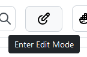
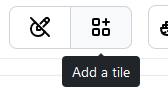
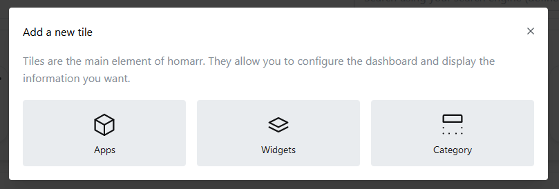
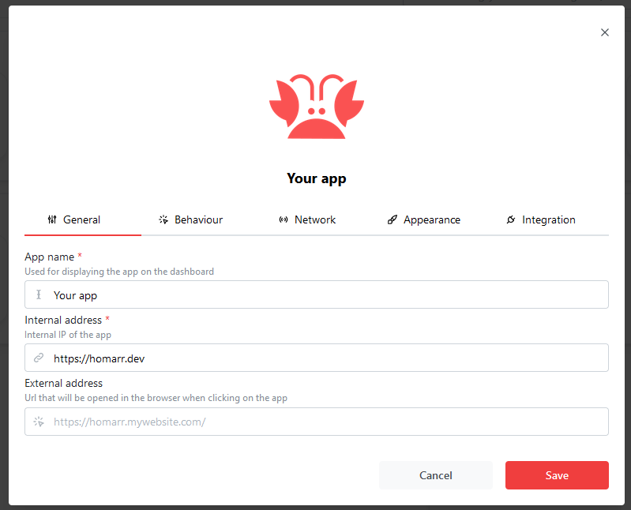
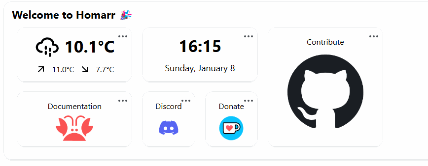
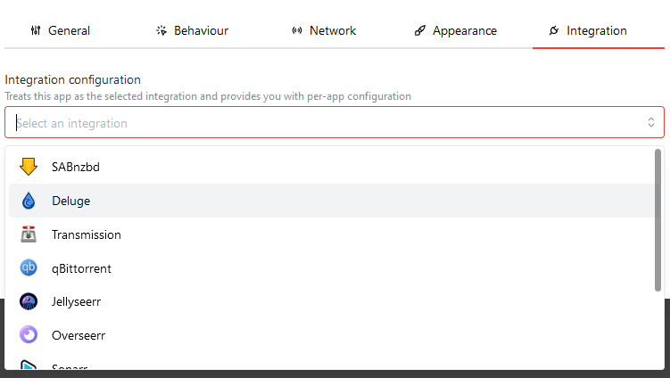

# 😎 After the installation
Congratulations! You've installed Homarr. You're probably just seeing a blank page now - let's change that now!

## Enter the edit mode
You can adjust your dashboard in the ``edit mode``. In the edit mode, you can move, edit and delete tiles.

You can enter the edit mode using this button:

When you're in the edit mode, this button will also feature a add button where you can add new tiles to your dashboard.

:::

info

After making changes to your dashboard, make sure to press this button again to exit the edit mode and save your changes to the configuration file. Otherwise, your changes will be lost.

:::

## Adding your first app
Let's begin by adding your first app to Homarr. Enter the edit mode and click on the add tile button:

Then, a popul will appear where you can choose the tile type you want to add. In this case, we'll add an app tile. Click on "Apps":

A new modal will open where you can enter the details of your app:

At all times, you must populate the following fields with data when you manage your apps:

- App Name
- Internal address
- App Icon

The icon will automatically adjust when you edit the app name.

:::

tip

The external address can be used for advanced use cases and improving security. For most apps however, you do not need to fill this field.

:::

## Organizing your dashboard
After you've added a few apps, it's time to organize it a bit better. While the edit mode is active, you can hover tiles on your dashboard and a small arrow at the bottom right will appear.

Using this arrow and holding down your left mouse button, you can resize them. If you hold the tile, you can move it around:

## Making use of categories
Altough this is already a decent way of organizing your tiles, it gets even better with categories.

You can add a category using the "Add tile" button while in the edit mode.

You can drag tiles in categories and between them. If you wish to reorder or adjust your categories, you can use the dots menu at the top right:

## Adding widgets to your dashboard

You can extend the functionality of your dashboard even further. Click the "Add a new tile" button again and choose "Widget".

Widgets are usually bigger tiles that feature some interaction or display data. Simply choose your desired widget from the list.

Wigets can be organized the same way as apps can be. Please note that some widgets require additional configuration or use your apps.

You can configure access to the applications using the "Integration" tab when you edit an app:

After choosing an integration type, you can configure the integration. Some integrations require passwords or token to access your data.

:::

info

Homarr has two types of integration configuration values: ``private`` and ``public``. Public values should not contain passwords or tokens, as they are being sent to the client. Private values will never be sent to any client, after you've saved and exited the edit mode. For this reason, you won't be able to read the values of your private credentials after setting them.

:::

:::

warn

The Homarr Team will never ask for your credentials. Do not send people your credentials, as they manage the access to your applications and can cause harm to your device if they are abused.

:::