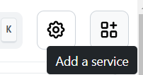

import imageAddService from './img/homarr-add-service.gif';
import imageReorderServices from './img/homarr-reorder-services.gif';
import imageChangingCategory from './img/homarr-changing-category.gif';
import imageCollapsingCategory from './img/homarr-collapsing-category.gif';

# 😎 After the installation
Congratulations! You've installed Homarr. You're probably just seeing a blank page now - let's change that now!

## Adding your first Services
First, let's click on "Add Service" to add your existing services as a card to Homarr:

After clicking the button, you'll get a popup, where you can configure the service.
You must always fill out the following fields:
- Service name
- Icon URL
- Service URL

When you change the name of your service, Homarr will automatically search for a matching icon.

 
 

:::info

Homarr will search [dashboard-icons](https://github.com/walkxcode/dashboard-icons) for any matching icons. You can manually change the value in the box or [use custom icons](../advanced-configuration/custom-icons.md).

:::

## Organizing your Services order
After you've added a few services, you can re-order them for better organization. Click and hold for atleast .25 seconds — then the item will enter the drag and drop mode. You can now drag the item to any preferred location.

## Organizing your Services into categories
By default, Homarr will place your services in the category "Others".
If you want to organize your services further, we recommend you to create custom categories:

 
 

Categories are collapsable. Collapse them by clicking on the title-bar of a category:
