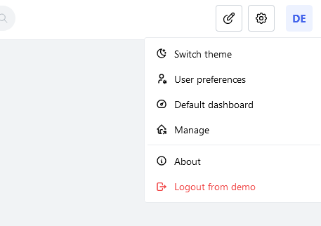

# 👤 Users

Each person accessing your Homarr is a user. Using the users management you can configure who has access to what boards.
A user may have multiple sessions on different devices and can log in from multiple locations at the same time.
Users will always have a username and password that they can use to log into their account.
Their password is encrypted using Bcrypt on regristration and can therefore not be read out - even with access to the database.

User management will only be available to the Owner and Admins. Normal users will not see and cannot access this page.

## Simple user management

1. To manage the users, navigate to the management pages using the **Manage** button in the menu at the top right:   
2. Open "Users" if it's not open and click on "Manage"   
3. The table will list the users. You can delete, promote or demote users from here.

## Create new users

To create a new user, you must [navigate to the user management page](#simple-user-management) first.
Clicking the **Create user** button will open a wizard that guides you through the process.
An username and password is mandatory. The password requirements must be uphold.
Using **Generate random** you can also generate a new password that already meets the password requirements.

:::note

As already mentioned, you won't be able to read out or reset passwords afterwards.
Ensure that you stored your password securely before you continue.

:::

In the last step, click the **Confirm** button to finish and complete the wizard.
After the wizard has been completed, the user can log in now ``YOUR-HOMARR-HOST/auth/login``.

## Invite new users

If you want to onboard users without entering them manually, you can send them unique invite links instead.
Invite links have an expiry date after which they no longer work.
Each invite link can only be used once. To create a new invitation link, click on **Invites** this time instead.

1. Click **Create invitation** to create a new invite link
2. Specify an expiry date. By default, it will be set to 7 days in the future.
3. Copy the invitation link. **You'll never be able to copy this link again**. Close the modal after you copied it.
4. Send the invitation link to your users. They'll be able to onbaord themselves.