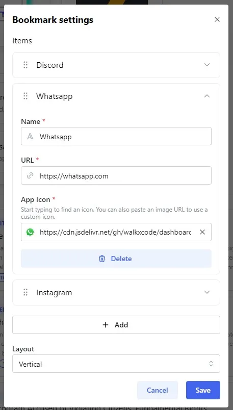
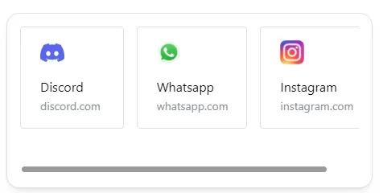

The Bookmarks widget enables you, to add a list of web pages or URLs to your dashboard - similar like bookmarks in Browsers.

---

## Adding the widget
Please check out our documentation on [how to add a widget](/docs/introduction/after-the-installation#adding-widgets).

---

## Configuration
This widget can be configured using an advanced visual editor.
You need to enter edit mode, to edit the bookmarks:

| Configuration         | Description | Values | Default Value |
| --------------------- | ----------- | ------ | ------------- |
| Items | List of bookmarks | - | Empty List |
| Layout | Changes the layout of the bookmarks | <ul><li>Auto-Grid</li><li>Horizontal</li><li>Vertical</li></ul> | Auto-Grid |

:::tip

Check out our documentation on [editing tiles](/docs/introduction/after-the-installation#organizing-and-re-arranging-your-dashboard).

:::

---

## Layouts
### Auto Grid
The Auto Grid mode will automatically scale the items.
Items will have a min width of 150px, but can scale bigger if they need more space.
If there is no space available, they will wrap.

### Vertical
Vertical mode will put items in a vertical list. Overflowing items will create a scroll bar.

### Horizontal
Horizontal mode will put items in a horizontal list. Overflowing items will create a scroll bar.

