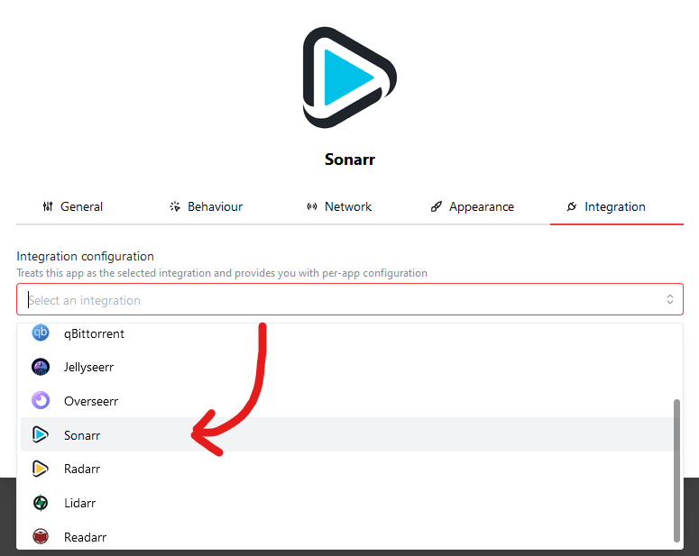
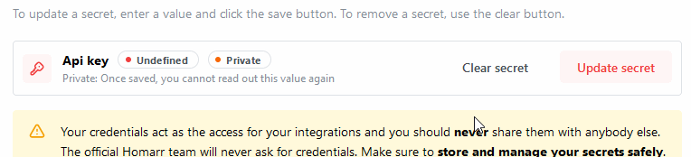
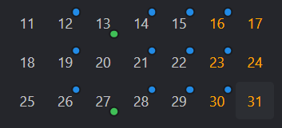
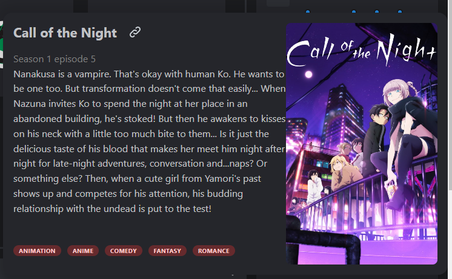
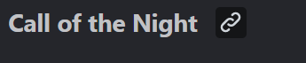
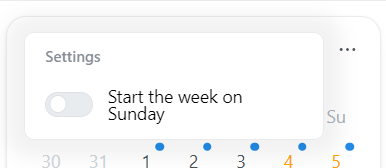
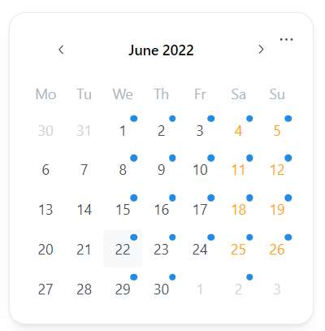
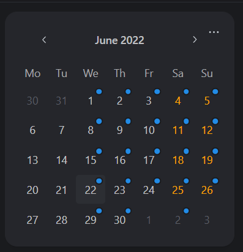
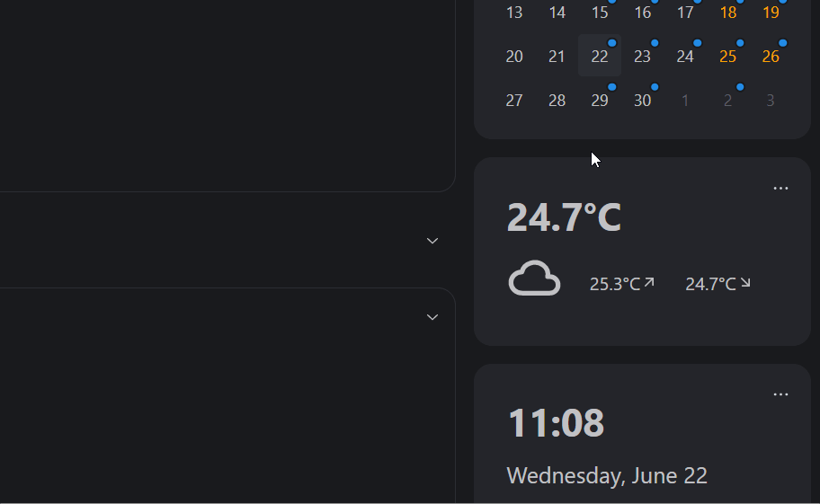

# 📆 Calendar Widget

The calendar Widget will use the Integrations to display upcoming content.
It can display upcoming conent from all supported media integrations.

The Supported integrations for the calendar widget currently, are:
[Sonarr](../integrations.md#sonarr), [Radarr](../integrations.md#radarr-integration), [Lidarr](../integrations.md#lidarr) and [Readarr](../integrations.md#readarr)

You must select the coresponding app type when adding your instances of the supported integrations, so Homarr can communicate with them accordingly:

After selecting the correct integration type, you must enter the access token:

You can retrieve your API token from the settings pages of your *arr applications.

## Add this widget to your Dashboard
You can add this widget via the edit mode. Please read [this guide on how to do so](index.md#adding-a-widget).

## Indicators for releases from your integrations

The calendar widget will use the calendar from your apps.
Currently, the calendar widget supports Readarr, Radarr, Sonarr and Lidarr.

:::info

Homarr will only load the previous, current and next month from your integrations. This means, releases in 2+ / 2- months will not be loaded and visible in the calendar.

:::

### Load data from your existing apps

Homarr loads the calendar data from your existing apps on your dashboard.
This means, if you want to integrate any of the above mentioned applications, you must add them as an app to the dashboard any select their coressponding app type:

The calendar widget will display only one indicator per day. This means, if you have multiple releases, from a single app or multiple apps, you may not see all indicators.

### Colors of indicators and their meaning

All indicators in the calendar have a specific color depending on their app:

| Color         | Integration | Project link                                 |
| ------------- | ----------- | -------------------------------------------- |
| 🔴 *(red)*    | Readarr     | [Readarr project link](https://readarr.com/) |
| 🟡 *(yellow)* | Radarr      | [Radarr project link](https://radarr.video/) |
| 🟢 *(green)*  | Lidarr      | [Lidarr project link](https://lidarr.audio/) |
| 🔵 *(blue)*   | Sonarr      | [Sonarr project link](https://sonarr.tv/)    |

## Release informations

Days with indicators can be clicked and offer additional information about all releases on this date:

The popup will display detailed information about the release, such as title, description, cover if available, tags if available and more.

:::info

We have noticed, that the scrollbar is on some devices poorly visible.
We'll fix this in a future update of Homarr.

:::

### Release Poster
Homarr will load the images from your integration, for example Sonarr.
It filters trough all images of the release and takes the first match, that is of the cover-type ``poster``.

:::warning

Some Adblockers are preventing Homarr from loading your posters. This is a [well known issue](../community/known-issues.md) in our community. To solve this issue, please disable your adblocker for Homarr.

:::

### Release Link

Homarr will add a little link button besides the title, which links to ImDb:

Please note, that the ImDb link will only be displayed for releases from Radarr and Sonarr.

## Configuration

| Configuration        | Description | Values | Default Value |
| -------------------- | ----------- | ------ | ------------- |
| Start week on sunday | Determines, if the calendar week should start on Sunday. If deactivated, Week will start on Monday. | yes / no | no |

:::tip

Check out our documentation on [how to configure a widget](index.md#configure-a-widget).

:::

## Screenshots

