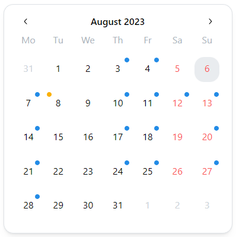
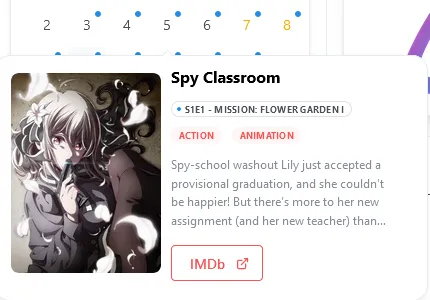

The calendar Widget will use [Integrations](/docs/integrations) to display upcoming content.
It can display content from [Sonarr](/docs/integrations#sonarr), [Radarr](/docs/integrations#radarr), [Lidarr](/docs/integrations#lidarr) and [Readarr](/docs/integrations#readarr).

---

## Adding the widget
Please check out our documentation on [how to add a widget](/docs/introduction/after-the-installation#adding-widgets).

---

## Adding integrations to the widget

Please make sure to select the appropriate integration type for your app, so the calendar widget can communicate with it:

Then, enter your API key and click on the save button:

*You can retrieve your API token from the settings pages of your \*arr applications.*

---

## Using the widget

The calendar widget will display a calendar with indicators for upcoming releases:

:::info

Homarr will only load the previous, current and next month from your integrations. This means, releases in 2+ / 2- months will not be loaded and visible in the calendar.

:::

### Colors of indicators and their meaning

All indicators in the calendar have a specific color depending on their app:

| Color         | Integration | Project link                                 |
| ------------- | ----------- | -------------------------------------------- |
| 🔴 *(red)*    | Readarr     | [Readarr project link](https://readarr.com/) |
| 🟡 *(yellow)* | Radarr      | [Radarr project link](https://radarr.video/) |
| 🟢 *(green)*  | Lidarr      | [Lidarr project link](https://lidarr.audio/) |
| 🔵 *(blue)*   | Sonarr      | [Sonarr project link](https://sonarr.tv/)    |

### Release information

All days with indicators will be clickable, highlight the clicked day, and will open a popup with detailed information about the releases on this day:

:::info

We have noticed, that the scrollbar is on some devices poorly visible.
We'll fix this in a future update of Homarr.

:::

#### Release Poster
Homarr will load the images from your integration, for example Sonarr.
It filters trough all images of the release and takes the first match, that is of the cover-type ``poster``.

:::warning

Some Adblockers are preventing Homarr from loading your posters. This is a [well known issue](/docs/community/known-issues.mdx) in our community. To solve this issue, please disable your adblocker for Homarr.

:::

## Configuration

| Configuration        | Description | Values | Default Value |
| -------------------- | ----------- | ------ | ------------- |
| Hide week days | Enable the name of the days on the first row of the calendar (This may cause problems fitting in 2 by 2). | yes / no | yes |
| Use Sonarr v4 API | If you use Sonarr, you may be using Sonarr v4, which uses a different API. If you do use it, then toggle this switch. | yes / no | no |
| Use Radarr v5 API | Same as for sonarr, if you are running radarr v5, toggle this switch. | yes / no | yes |
| Radarr release type | Select what type of release date to see. | <ul><li>Cinemas</li><li>Physical</li><li>Digital</li></ul> | In Cinemas |
| Font Size | Size of the font of the numbers in the calendar. This is to help have a better fit onto bigger sizes (Other than extra small might not be fit for 2 by 2). | <ul><li>Extra Small</li><li>Small</li><li>Medium</li><li>Large</li><li>Extra Large</li></ul> | Extra Small |

:::info

If you come from older versions, or just wondering, the start of the week field is now in the user options so any user can have the format they want.
The API fields will also be removed in a future update with API recognition automatization.

:::

:::tip

Check out our documentation on [editing tiles](/docs/introduction/after-the-installation#organizing-and-re-arranging-your-dashboard).

:::
