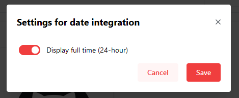
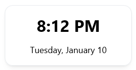
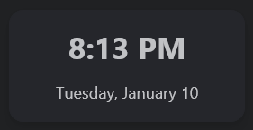

The Clock Widget will display the current time and date. The Widget will use your current system time. If you are using Docker, ensure that the [timezone is set correctly](/docs/advanced/docker-configuration#timezone-settings).

---

## Adding the widget
Please check out our documentation on [how to add a widget](/docs/introduction/after-the-installation#adding-widgets).

---

## Configuration

| Configuration         | Description | Values | Default Value |
| --------------------- | ----------- | ------ | ------------- |
| Display full time (24 hour format) | Determines if the clock displays in 12 or 24 hour format | yes / no | yes |

:::tip

Check out our documentation on [editing tiles](/docs/introduction/after-the-installation#organizing-and-re-arranging-your-dashboard).

:::

---

## Screenshots

