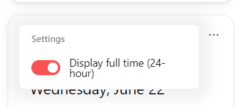
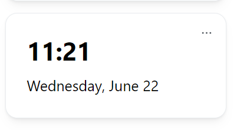
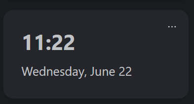

# 🕓 Clock Widget

The Clock Widget will display the current time and date. The Widget will use your current system time. If you are using Docker, ensure that the timezone is set correctly.

## Add this widget to your Dashboard
You can add this widget via the edit mode. Please read [this guide on how to do so](index.md#adding-a-widget).

## Configuration

| Configuration         | Description | Values | Default Value |
| --------------------- | ----------- | ------ | ------------- |
| Display full time (24 hour format) | Determines if the clock displays in 12 or 24 hour format | yes / no | yes |

:::tip

Check out our documentation on [how to configure a widget](index.md#configure-a-widget).

:::

## Screenshots

