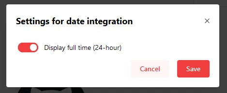

The Clock Widget will display the current time and date. The Widget will use your current system time. If you are using Docker, ensure that the [timezone is set correctly](/docs/advanced/docker-configuration#timezone-settings).

---

## Adding the widget
Please check out our documentation on [how to add a widget](/docs/introduction/after-the-installation#adding-widgets).

---

## Configuration

| Configuration         | Description | Values | Default Value |
| --------------------- | ----------- | ------ | ------------- |
| Display full time (24 hour format) | Determines if the clock displays in 12 or 24 hour format | yes / no | no |
| Date formatting | Select how you want the date to be displayed | see [Screenshots](#screenshots) | Weekday, month day |
| Display a custom Timezone | In case you want to show a timezone different from where you currently are, after toggling this option, you may select the city using the following options | yes / no | no |
| Timezone location | Location selector, choose the city and it will automatically get you the coordinates. | City name | Paris |
| City Title | Choose if you want to add a title above the time to show the city you selected and the timezone code it is in. | <ul><li>City and Timezone</li><li>City only</li><li>None</li></ul> | City and Timezone |

:::tip

Check out our documentation on [editing tiles](/docs/introduction/after-the-installation#organizing-and-re-arranging-your-dashboard).

:::

---

## Screenshots

