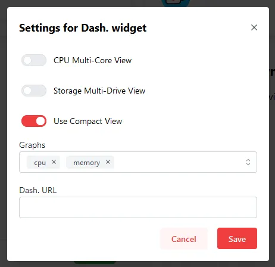
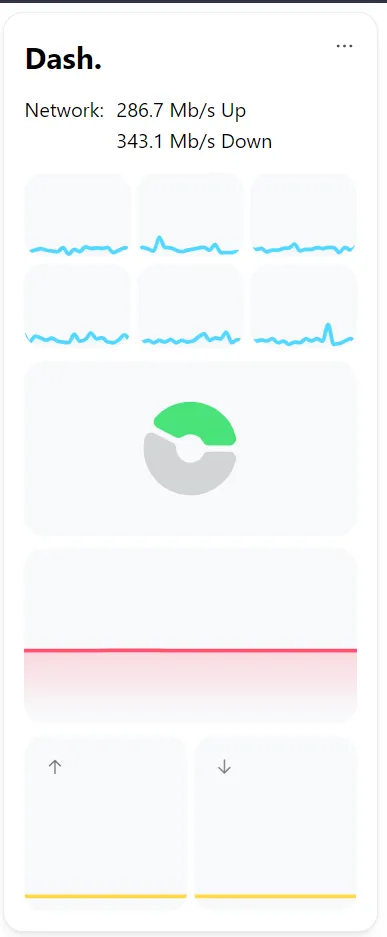

The Dash. widget will integrate your existing Dash. instance into Homarr. The graphs will be integrated using [iframe](https://developer.mozilla.org/en-US/docs/Web/HTML/Element/iframe).
Additionally, you can enable or disable certain graphs, or enable the Multi-Core view for the CPU.

---

## Adding the widget
Please check out our documentation on [how to add a widget](/docs/introduction/after-the-installation#adding-widgets).

:::tip

If you want to quickly test the widget, before installing Dash. on your machine, we recommend to use the public demo server of Dash.
`https://dash.mauz.dev/`

:::

---

## Installation
To use the widget, you need to install [Dashdot](https://github.com/MauriceNino/dashdot) on your server. We recommend that you install it using Docker.

### Install Dash. using Docker
```
docker container run -it \
  -p 80:3001 \
  -v /:/mnt/host:ro \
  --privileged \
  mauricenino/dashdot
```

### Install Dash. using Docker compose
```
version: '3.5'

apps:
  dash:
    image: mauricenino/dashdot:latest
    restart: unless-stopped
    privileged: true
    ports:
      - '80:3001'
    volumes:
      - /:/mnt/host:ro
```

### More Installation options
You can find more installation options on the Dash. [documentation page](https://getdashdot.com/docs/install).

---

## Configuration
| Configuration         | Description | Values | Default Value |
| --------------------- | ----------- | ------ | ------------- |
| CPU Multi-Core View | Shows the usage of each core instead of the total usage | yes / no | no |
| Storage Multi-Drive View | Shows the usage of each drive visible to Dash. instead of the total usage | yes / no | no |
| Use Compact View | Reduce the size of the individual graphs, which makes them use less space. Recommended for smaller screens | yes / no | no |
| Graphs | Selection of the Dash. graphs, which should be displayed | yes / no | CPU, RAM, Storage, Network |
| Dash. URL | The address of your Dash. installation | string | *none* |



:::tip

Check out our documentation on [editing tiles](/docs/introduction/after-the-installation#organizing-and-re-arranging-your-dashboard).

:::

---

## Reverse Proxy Configuration
Homarr will embed the graphs of your Dash. instance.
Because of this, some users may experience problems, if they serve their Dash. instance using a reverse proxy.
While there are multiple reasons for this, the most common by far is that the reverse proxy is blocking access to Dash. using [iframes](https://developer.mozilla.org/en-US/docs/Web/HTML/Element/iframe).

Depending on which reverse proxy you're using, you must configure them differently to allow access via iframes.
Please note that iframes can be considered dangerous under some circumstances - we recommend you to read this answer on Stackoverflow entirely for understanding the risks involved with iframes (especially when you expose via a public domain): https://stackoverflow.com/a/9428051/15257712

If you want to proceed, you must configure this header on your reverse proxy: https://developer.mozilla.org/en-US/docs/Web/HTTP/Headers/X-Frame-Options. Generally, in most cases you want to use ``SAMEORIGIN``. ``ALLOW-FROM <uri>`` is obsolete and no longer works in most browsers.

## Reverse Proxy with NGINX - Example for multiple instances of Dash.
Because Dash. uses iframes to display the graphs, you can run into problems when using a reverse proxy to access them.  There are two ways you can do this, either by using subdomains for each instance of Dash. or by using subpaths.  

You can use a subdomain for each instance of Dash. and simply use instanceone.domain.come, instancetwo.domain.com, instancethree.domain.com, ect. for your instances, and simply point anything sent to that domain to your Dash. instance in NGINX.  That would require seperate configuration files and subdomains for each instance. 
<details><summary>

Subdomain Example

</summary>

You would need multiple configuration files, one for each subdomain/instance of Dash.  This is an example without SSL.  (run certbot with this file to enable SSL)  Replace the server_name and the ip and port of your docker container to match your environment.  The default port for Dash. is 3301

Instance 1
```
server{
listen 80;
listen [::]:80;
server_name instanceone.domain.com;
location / {
  proxy_pass http://ip.of.dash.container:port;
  }
}
```
Instance Two
```
server{
listen 80;
listen [::]:80;
server_name instancetwo.domain.com;
location / {
  proxy_pass http://ip.of.dash.container:port;
  }
}
```
Instance Three
```
server{
listen 80;
listen [::]:80;
server_name instancethree.domain.com;
location / {
  proxy_pass http://ip.of.dash.container:port;
  }
}
```

</details>

You can also use subpaths, which only requires one subdomain and configuration file for each, allowing your Dash. and your Homarr instances to all exist on the same subdomain.  However, when Homarr attempts to pull the iframes, it will attempt to pull from sub.domain.com/assets, instead of sub.domain.com/instance/assets.  So, you simply rewrite the incomming requests and modify the path, and that will connect your Homarr and Dash. instances.  
<details><summary>

Subpaths Example

</summary>

You only need one configuration file.  This is an example without SSL.  (run certbot with this file to enable SSL)  Replace the server_name and the ip and port of your docker container to match your environment.  The default port for Dash. is 3301  This configuration will allow you to use Homarr and reference the Dash. instances under the same domain/subdomain.

```
server{
listen 80;
listen [::]:80;
server_name dashboard.domain.com;
location / {
  proxy_pass http://ip.of.homarr.container:port;
  }
if ($http_referer ~ ^https?://dashboard.domain.com/instanceone) {
  rewrite !/(.*)$ /instanceone/$1 last;
  }
location /instanceone/ {
  proxy_pass http://ip.of.dash.container:port;
  }
if ($http_referer ~ ^https?://dashboard.domain.com/instancetwo) {
  rewrite !/(.*)$ /instancetwo/$1 last;
  }
location /instancetwo/ {
  proxy_pass http://ip.of.dash.container:port;
  }
if ($http_referer ~ ^https?://dashboard.domain.com/instancethree) {
  rewrite !/(.*)$ /instancethree/$1 last;
  }
location /instancethree/ {
  proxy_pass http://ip.of.dash.container:port;
  }
}
```

</details>
Then, you can add the instances to Homarr using either the subdomain or subpath using the Dash. integration.  

---

## Screenshots


