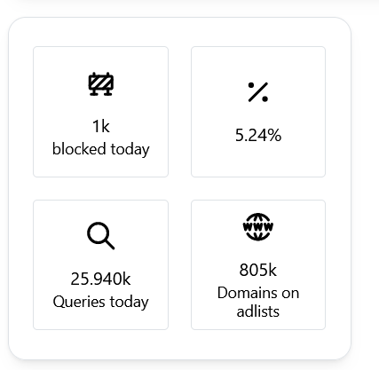
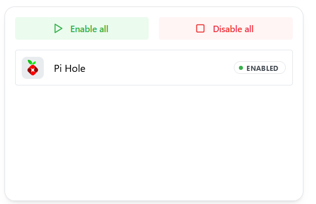

If you're running a PiHole or AdGuard Home instance, you might want to display statistics on your dashboard or control them.
This widget enables you to integrate crucial data on your dashboard and control your instances directly from Homarr.

---

## Adding the widget
Please check out our documentation on [how to add a widget](/docs/introduction/after-the-installation#adding-widgets).

There must be at least one app on your dashboard, that has it's integration set to PiHole or AdGuard Home.

For PiHole, you must retrieve the API token via WebUI:
1. Log in to your PiHole admin dashboard. If you use the default hostname, you can use this direct link: http://pi.hole/admin
2. Go to the settings
3. Click on the "API / Web interface" tab
4. Click the button "Show API token"
5. Confirm that you want to show your API token on screen
6. Copy **the raw API token** and paste it in your PiHole app in Homarr under the intgeration tab

For Adguard, you can use the username and password, that you use to log in.

---

## Configuration

| Configuration         | Description | Values | Default Value |
| --------------------- | ----------- | ------ | ------------- |
| Use colors from PiHole | Color the tiles using the background color, that is used by default in PiHole. | yes/no | yes |

:::tip

Check out our documentation on [editing tiles](/docs/introduction/after-the-installation#organizing-and-re-arranging-your-dashboard).

:::

---

## Screenshots

