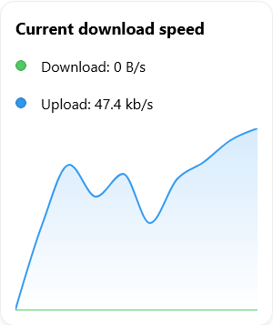
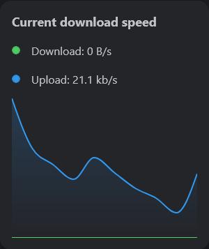

The Download Speed Widget use [Integrations](/docs/integrations) to display your current download and upload speed of supported Download Clients.

---

## Adding the widget
Please check out our documentation on [how to add a widget](/docs/introduction/after-the-installation#adding-widgets).

---

## Configuration

This widget does not offer any configurations. It will automatically use the configured [Download Client Integration](/docs/integrations).

:::tip

Check out our documentation on [editing tiles](/docs/introduction/after-the-installation#organizing-and-re-arranging-your-dashboard).

:::

---

## Screenshots

