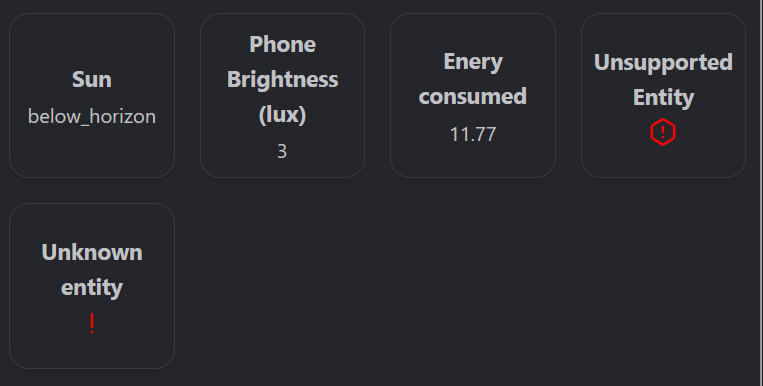
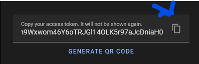
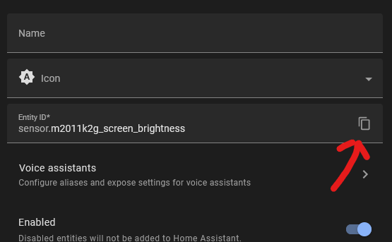

The entity state (aka. Home Assistant) enables you to display the current state of an entity from Home Assistant.
This works with most entities in Home Assistant and enables you display almost any data.
It is recommended that you transform data on Home Assistant as much as possible since Homarr's capabilities in transformation are very limited.

Here's an example of what you can display:  

### Obtaining the Home Assistant token
To let Homarr communicate with Home Assistant, you need to create a long lived access token.
As of 2023, each token will be valid for 10 years until they expire.
To obtain a new token, log in on your Home Assistant and navigate:
1. Click on your user profile at the bottom left
2. Scroll down to the section **Long-lived access tokens** bottom of the page
3. Click on the **Create Token** button
4. Enter a name for your token. We recommend ``Homarr`` or your server hostname suffixed by ``-homarr``.
5. After you confirmed the name a secret token will show. This will permit access to your Home Assistant instance - make sure to not share this with anybody else.
**Click on the copy icon** at the rightmost. After you close this popup you will no longer be able to retrieve the token.  

### Adding a home assistant app to your board
After copying the token you can add your app to the board.
Make sure to enter the correct address and select **Home Assistant** as the integration.
Refer to [the introduction guide](../../introduction/after-the-installation.mdx) for more information.

### Add widget to fetch an entity state
The last step is to add the widget itself to display an entity state.
To do this, navigate to the following page on your Home Assistant:

1. Click on **Settings** in the left navigation bar
2. Click on **Devices & services**
3. Click on the **Entities** tab at the top
4. (Optional): Search for your entity by using the search box and filters
5. Click on your desired entity. A popup will open.
6. Click on the small cog icon at the top right.
7. Click the copy icon in the **Entity ID** field:  

Now, you can add the widget:

1. Open Homarr
2. Enter edit mode
3. Click on the plus button to add the widget
4. Select **Widgets**
5. Search for the Home Assistant widget
6. Exit the modal and click on the cog icon at the top of the newly added widget
7. Enter the previously copied **Entity ID** to the field.
8. (Optional): Set a custom display name
9. Save the widget and exit edit mode.

You may need to wait a bit for the entity state to appear.

### Common problems
#### Entity loading for a long time
You may need to use different addresses or use less Home Assistant instances if you have multiple.

#### Using multiple instances
You can add multiple instances of Home Assistant to your board.
Please note that requests will be made sequentally to all instances until the entity has been found.
If no entity matching the ID is found an error will be displayed on the widget.

#### Widget displays human unreadable text
Sadly, some entities cannot be displayed directly and you may need to transform it on Home Assistant using the "Helpers".

#### Widget states that it's unable to display the entity
Currently not all formats of entities can be displayed.
The Homarr team will continiue to implement more and more of them.
You can either report this issue via GitHub or use the above mentioned "Helpers" to simplify the entity.
Note that you need to copy the entity ID of said new helper entity.