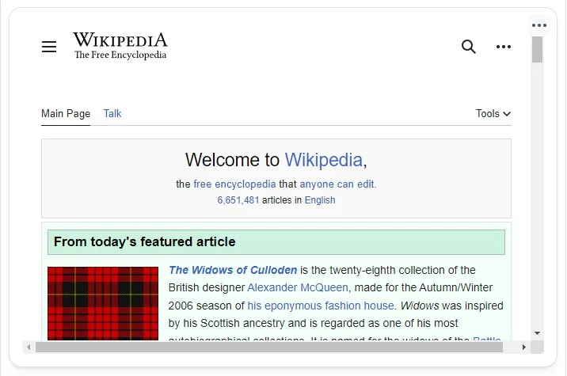

If you application is not supported natively by Homarr, you can integrate it using the iframe widget.
It uses the [iframe element](https://developer.mozilla.org/en-US/docs/Web/HTML/Element/iframe),
which emeds the desired page in the browser.
This means, no traffic is routed through Homarr (and the URL must be reachable from the client).

Athough you can integrate many websites, some may not work.
This is because the administrators of those sites disallow iframes
for security reasons, as users could easily be tricked
by embeding the original site on a malicious page.

Some proxies disallow iframes by default for this reason.
You can use https://iframetester.com/ to check, if the site is allowing iframes.
If you manage all of your own applications, you can usually change that.

If you want to test a page, you can use the following URL:
https://en.wikipedia.org/wiki/Main_Page

iframes can be used to host streaming content, such as a youtube video, by directly linking the embed source, you can test this with the NASA ISS stream:
https://www.youtube.com/embed/K5JSRGhB-nM?si=XRV7_NjreHywZbYS

---

## Adding the widget
Please check out our documentation on [how to add a widget](/docs/introduction/after-the-installation#adding-widgets).

---

## Configuration

| Configuration         | Description | Values | Default Value |
| --------------------- | ----------- | ------ | ------------- |
| Embed URL | The page that should be embedded | URL | - |
| Allow full screen | Allow pages inside the iframe to enter full screen | yes / no | no |
| Allow scrolling | Allows scrolling pass through to iframe | yes / no | yes |
| Allow transparency | Allows scrolling pass through from iframe (board transparency settings do not impact the iframe, only the border) | yes / no | no |
| Allow payment | Allow payment information pass through to iframe | yes / no | no |
| Allow auto play | Allows videos to autoplay | yes / no | no |
| Allow microphone | Allows microphone pass through to iframe | yes / no | no |
| Allow camera | Allows camera pass through to iframe | yes / no | no |
| Allow geolocation | Allows geolocation pass through to iframe | yes / no | no |

:::tip

Check out our documentation on [editing tiles](/docs/introduction/after-the-installation#organizing-and-re-arranging-your-dashboard).

:::

---

## Screenshots

