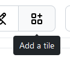
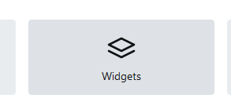

# Widgets

Homarr offers a collection of different widgets, which help you expand and personalize your experience.

## Available widgets

| Module          | Description |
| --------------- | ----------- |
| [Torrent](module-torrent.md)  | The Torrent Module uses Integrations to display a list of torrents with their name, download and upload speed and progress.  |
| [Clock](module-clock.md)     | The Clock Module is a very simple Module that will display the current time and date. |
| [Calendar](module-calendar.md) | The Calendar Module uses Integrations to display upcoming content. |
| [Weather](module-weather.md)  | The Weather Module uses your location to display the current, highest and lowest temperature. |
| [Dash.](module-dashdot.md)      | The Dash. Module will integrate the graphs of your existing instance of Dash. |
| [Overseerr](module-overseerr.md)      | The Overseerr module will enable you to request series and movies from your Homarr instance |
| [Usenet](module-usenet.md)       | The usenet module uses integrations to display a list of usenet downloads with their name, download speed, and progress.

## Adding a widget

First, enter the edit mode and click on the "Add a tile" button:

Then, click on "Widgets" in the next modal:

Next, you can select your desired widget and add it to your dashboard.

