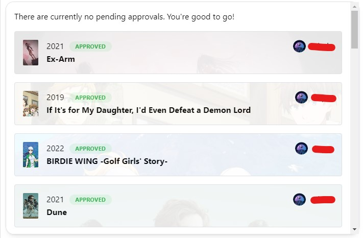
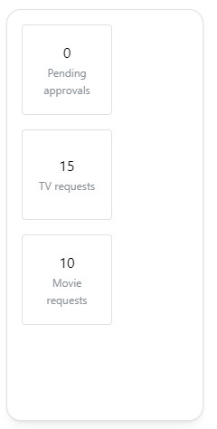

The media requests widget enables you to integrate with [Overseerr and Jellyseerr](/docs/integrations/#overseerr--jellyseerr).
Using the widget, you can view the current media requests.

---

## Adding the widget
Please check out our documentation on [how to add a widget](/docs/introduction/after-the-installation#adding-widgets).

---

## Configuration
This widget does not have any configuration.

---

## Screenshots

