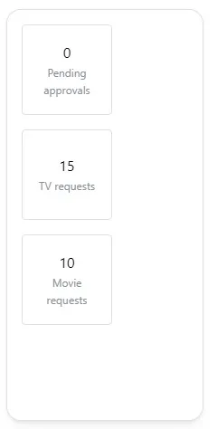

The media requests widget enables you to integrate with [Overseerr and Jellyseerr](/docs/integrations/#overseerr--jellyseerr).
Using the widget, you can view the current media requests.

---

## Adding the widget
Please check out our documentation on [how to add a widget](/docs/introduction/after-the-installation#adding-widgets).

---

## Configuration
Both media requests widget have the same configurations.

| Configuration         | Description | Values | Default Value |
| --------------------- | ----------- | ------ | ------------- |
| Replace links with external host | Will use the external address provided in the app configuration instead of the internal one. | yes / no | no |
| Open links in new tab | Every link will open in a new tab instead if in the current tab. | yes / no | yes |

---

## Screenshots

