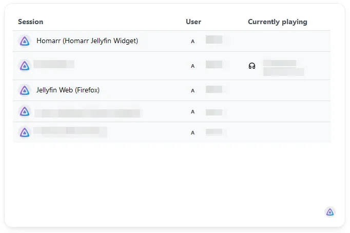
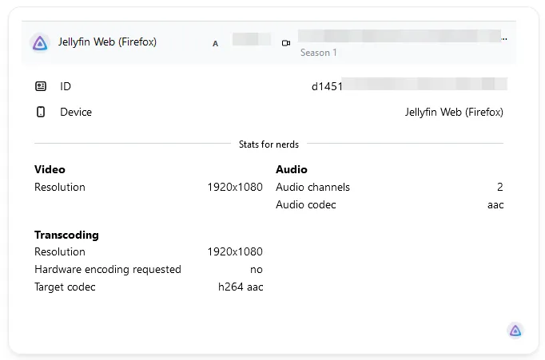

import Tabs from '@theme/Tabs';
import TabItem from '@theme/TabItem';

The media server widget enables you to watch and view current active sessions over all your media servers.
It also displays useful information, that you can use when providing support to users or debugging a problem.

---

## Adding the widget
Please check out our documentation on [how to add a widget](/docs/introduction/after-the-installation#adding-widgets).

---

## Configuration
This widget does not offer any configurations. It uses the configured credentials from your [media server apps](../integrations/index.mdx#media-servers).
:::tip

Check out our documentation on [editing tiles](/docs/introduction/after-the-installation#organizing-and-re-arranging-your-dashboard).

:::

---

## Common issues
Is the widget not working? Please try out the following tips and tricks to possibly resolve your issue:

<Tabs>
  <TabItem value="jellyfin" label="Jellyfin" default>

- Use a URL that does not terminate on a single ``/`` or something like ``/web`` or ``index.html``. This may break the integration. Only use the main domain of your server.
- Make sure that your container has access to the media server. Try making a ping to it.
- Use valid credentials, that have been created for Homarr in the Jellyfin administration dashboard.
- Permit access to the required libraries and grant the required permissions.

  </TabItem>
  <TabItem value="plex" label="Plex">

- Use a URL that does not terminate on a single ``/`` or something like ``/web`` or ``index.html``. This may break the integration. Only use the main domain of your server.
- Make sure that your container has access to the media server. Try making a ping to it.
- Use a token, that has been created from your Plex. You can retrieve the token using this official guide: https://support.plex.tv/articles/204059436-finding-an-authentication-token-x-plex-token/
  - Make sure the token isn't expired.
  - No token visible? Try logging out and in again.
- Do not use the cloud or remote URLs. The integration will only work for local instances. Do not worry, as Homarr will act as a primitve reverse proxy when you're outside the network of Plex.
- Permit access to the required libraries and grant the required permissions.

  </TabItem>
</Tabs>

---

## Stats for nerds
The widget will display additional information, if you click on a session.
Stats for nerds contain highly detailed information, that may help you troubleshoot encoding issues.
Since not all media servers expose the same information, some information may be unavailable depending on the type.

---

## Screenshots

