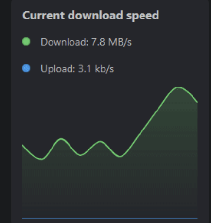

# 🚀 Download Speed Widget

The download speed widget integrates with your existing download apps via [integrations](./../integrations/integrations). It refreshes each second and will display the last 10 measurements of the download and upload speed of your download apps.

## Activate the Widget
Please read our documentation on [how to enable a widget](index.md#activating-a-widget).

## Configuration

This widget does not offer any configurations. You may configure your download client apps instead.

## Screenshots

