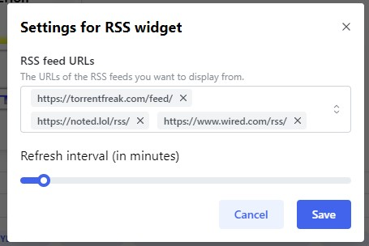
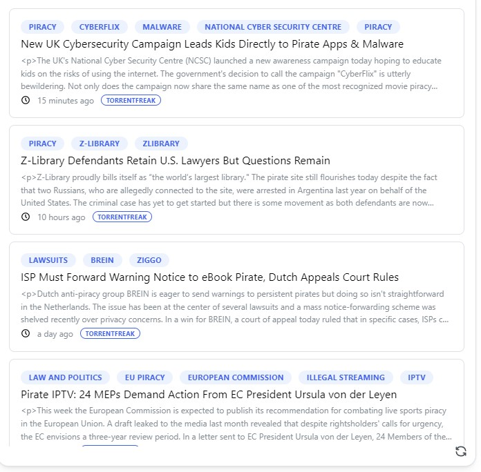

Using the RSS standard, you can integrate most News websites, applications and more
on your dashboard.

---

## Adding the widget
Please check out our documentation on [how to add a widget](/docs/introduction/after-the-installation#adding-widgets).

---

## Example feeds
Here's a small collection of examples, that you can use for testing or actual use (in no particular order):
- https://noted.lol/rss/
- https://blog.google/products/chrome/rss/
- https://www.w3.org/blog/feed/
- https://partner-feeds.beta.20min.ch/rss/20minuten
- http://rss.cnn.com/rss/money_topstories.rss
- https://www.wired.com/rss/
- http://www.chinadaily.com.cn/rss/world_rss.xml
- https://www.srf.ch/news/bnf/rss/1646
- https://torrentfreak.com/feed/
- http://rss.nytimes.com/services/xml/rss/nyt/HomePage.xml
- http://feeds.foxnews.com/foxnews/latest

There is a good list of feeds here:
https://github.com/greysonp/rss-feeds/blob/master/feeds.json

## Configuration

| Configuration         | Description | Values | Default Value |
| --------------------- | ----------- | ------ | ------------- |
| RSS feed urls | A list of RSS feed URLs. They must meet the [RSS XML specification](https://validator.w3.org/feed/docs/rss2.html). | List of URLs | Empty list |
| Refresh interval | The interval in minutes, when the widget refreshes the feeds. | 1-300 | 30 |

:::tip

Check out our documentation on [editing tiles](/docs/introduction/after-the-installation#organizing-and-re-arranging-your-dashboard).

:::

---

## Screenshots

