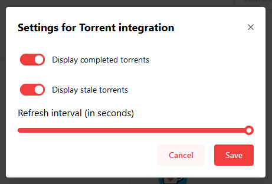
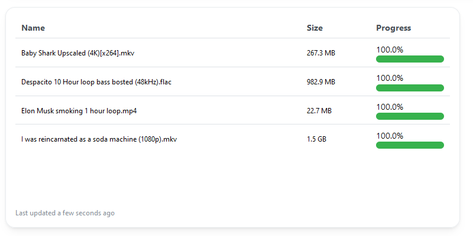

The Torrent widget uses [Integrations](/docs/integrations) to display a list of torrents with their name, download/upload speed and progress.

---

## Adding the widget
Please check out our documentation on [how to add a widget](/docs/introduction/after-the-installation#adding-widgets).

---

## Configuration

You can configure this widget when the [Edit Mode](/docs/introduction/after-the-installation#entering-edit-mode) is active by clicking on the menu.

| Configuration         | Description | Values | Default Value |
| --------------------- | ----------- | ------ | ------------- |
| Display completed torrents | Display torrents that have completed | yes / no | yes |
| Display stale torrents | Display torrents that are stale | yes / no | yes |
| Refresh interval | Changes the refresh interval of your widget | 1s - 60s | 10s |

:::tip

Check out our documentation on [editing tiles](/docs/introduction/after-the-installation#organizing-and-re-arranging-your-dashboard).

:::

---

## Screenshots

