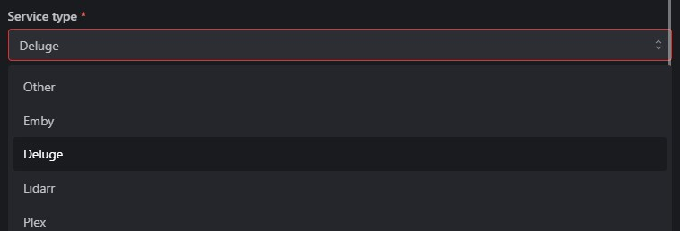
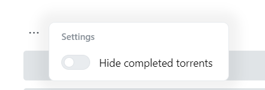
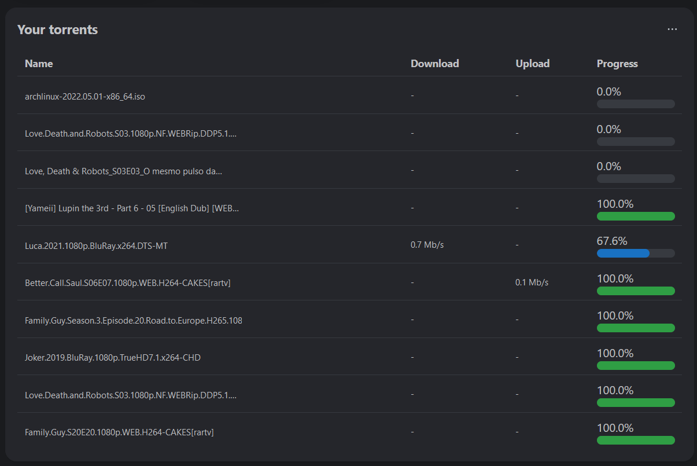

# 🎞️ Torrent Widget

The torrent widget uses integrations to display a list of torrents with their name, download and upload speed and progress. It supports displaying the progress from many download clients concurrently.

:::tip

To add your download app as an integration, click on your app and select the corresponding app type:

:::

## Activate the Widget
Please read our documentation on [how to enable a widget](index.md#activating-a-widget).

## Configuration

| Configuration         | Description | Values | Default Value |
| --------------------- | ----------- | ------ | ------------- |
| Hide completed torrents | Determines if completed torrents should be hidden | yes / no | no |

:::tip

Check out our documentation on [how to configure a widget](index.md#configure-a-widget).

:::

## Screenshots

