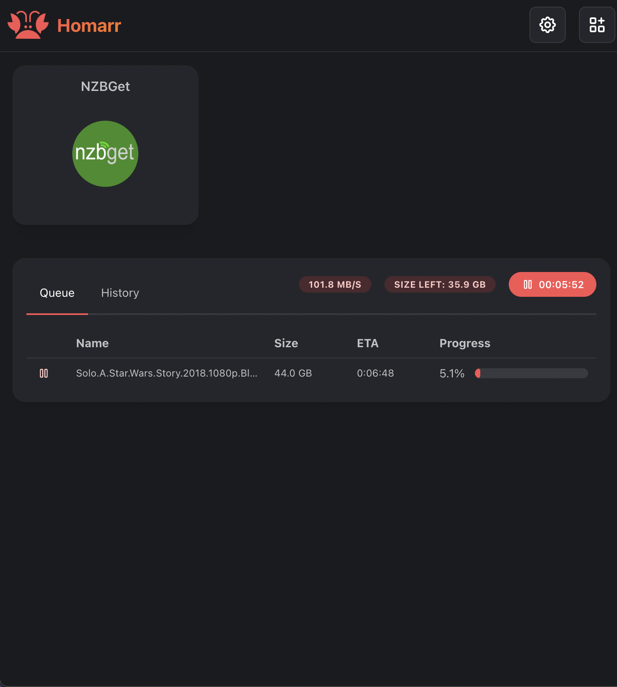

# 📁 Usenet Widget

The usenet widget uses integrations to display a list of usenet downloads with their name, download speed, and progress. It supports displaying the progress from Sabnzbd & NZBGet download clients concurrently.

:::tip

To add your download app as an integration, click on your app and select the corresponding app type:

Depending on the usenet app you are using, you will need to ensure you are providing authentication (Sabnzbd = API key, NZBGet = username & password).

:::

## Activate the Widget
Please read our documentation on [how to enable a widget](index.md#activating-a-widget).

## Configuration

There are no configuration options for the usenet widget.

:::tip

Check out our documentation on [how to configure a widget](index.md#configure-a-widget).

:::

## Screenshots

