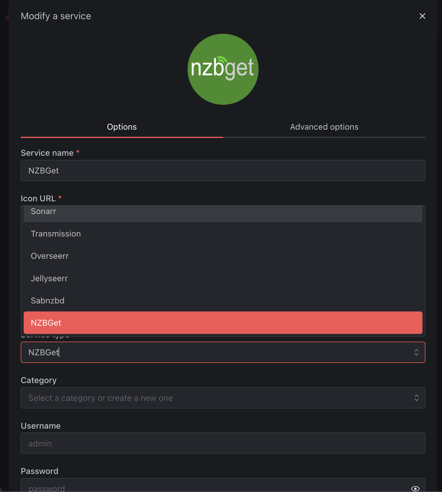
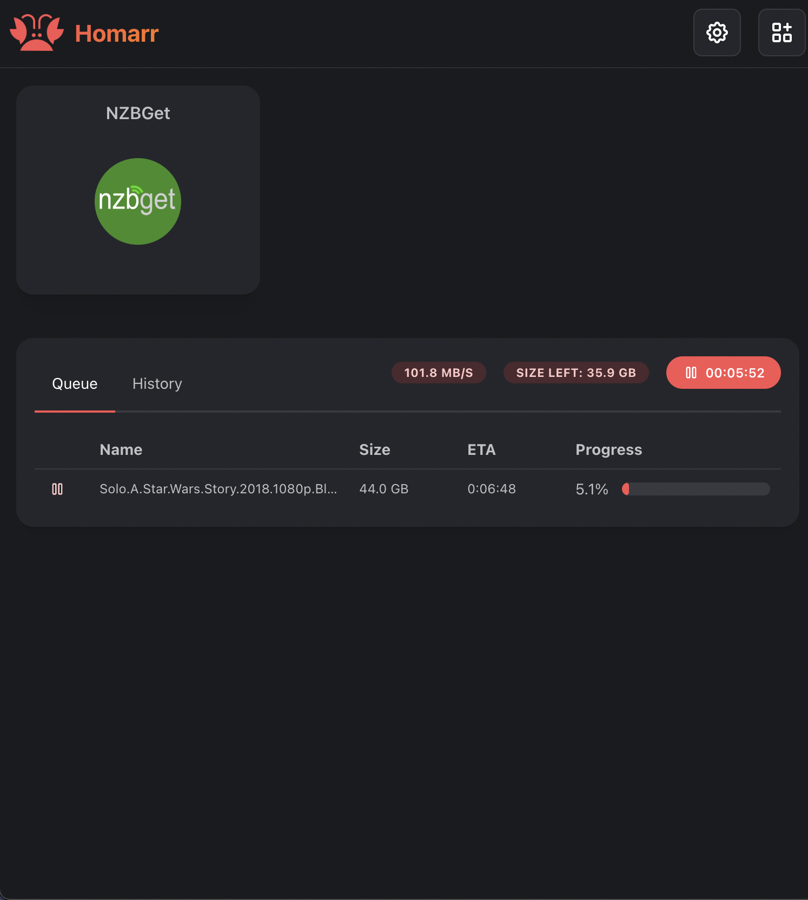

# 📁 Usenet Module

The usenet module uses integrations to display a list of usenet downloads with their name, download speed, and progress. It supports displaying the progress from Sabnzbd & NZBGet download clients concurrently.

:::tip

To add your download service as an integration, click on your service and select the corresponding service type:

Depending on the usenet service you are using, you will need to ensure you are providing authentication (Sabnzbd = API key, NZBGet = username & password).

:::

## Activate the Module
Please read our documentation on [how to enable a module](index.md#activating-a-module).

## Configuration

There are no configuration options for the usenet module.

:::tip

Check out our documentation on [how to configure a module](index.md#configure-a-module).

:::

## Screenshots

