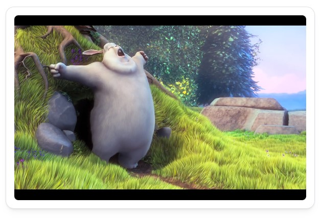

Do you run surveilance cameras? Or maybe you have a favourite video?
The video widget enables you to integrate both seamlessly into your dashboard.
This widget uses [video.js](https://videojs.com/) to play HLS or DASH video natively.

DRM content is not yet supported. More info here:
https://videojs.com/guides/faqs/#q-what-is-videojs

You can use the following URL to test:
http://commondatastorage.googleapis.com/gtv-videos-bucket/sample/BigBuckBunny.mp4

---

## Adding the widget
Please check out our documentation on [how to add a widget](/docs/introduction/after-the-installation#adding-widgets).

---

## Configuration

| Configuration         | Description | Values | Default Value |
| --------------------- | ----------- | ------ | ------------- |
| Feed URL | The URL of the streamable content. It must contain the direct video file, a link to Youtube won't work. | URL | - |
| Autoplay | If checked, the content will be played automatically. | yes / no | yes |
| Muted audio | If checked, the content will be muted. | yes / no | yes |
| Controls | If checked, controls will be displayed to control playback. | yes / no | no |

:::tip

Check out our documentation on [editing tiles](/docs/introduction/after-the-installation#organizing-and-re-arranging-your-dashboard).

:::

---

## Screenshots

