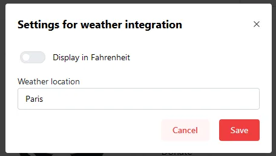
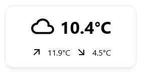

The Weather Widget uses your location to display the current, highest and lowest temperature. The Widget uses [open-meteo.com](https://open-meteo.com) to retrieve weather data.

The Widget **does not request your browsers location**, you must specify a location yourself using the Widget's settings.

---

## Adding the widget
Please check out our documentation on [how to add a widget](/docs/introduction/after-the-installation#adding-widgets).

---

## Configuration

| Configuration         | Description | Values | Default Value |
| --------------------- | ----------- | ------ | ------------- |
| Display in Fahrenheit | Displays the temperature in °F. | yes / no | no |
| Display City Name | Adds the city's name at the bottom. | yes / no | yes |
| Weather Location | Location selector, choose the city and it will automatically get you the coordinates. | City name | Paris |

:::tip

Check out our documentation on [editing tiles](/docs/introduction/after-the-installation#organizing-and-re-arranging-your-dashboard).

:::

---

## Screenshots

